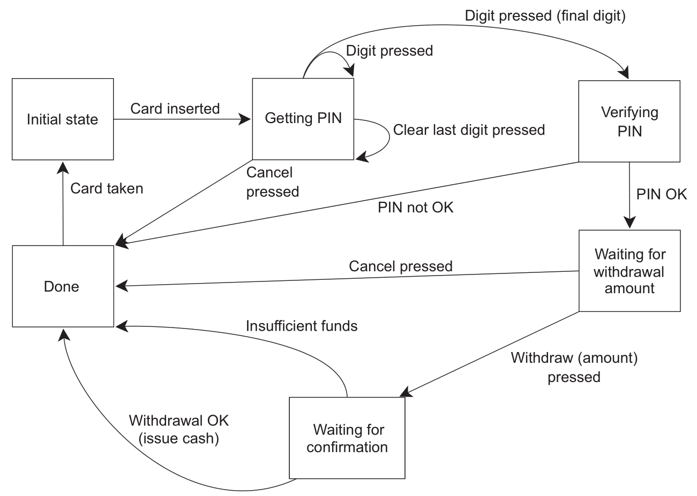

## 条件变量（condition variable）

* 在并发编程中，一种常见的需求是，一个线程等待另一个线程完成某个事件后，再继续执行任务。对于这种情况，标准库提供了 [std::condition_variable](https://en.cppreference.com/w/cpp/thread/condition_variable)

```cpp
#include <condition_variable>
#include <iostream>
#include <mutex>
#include <thread>

class A {
 public:
  void step1() {
    {
      std::lock_guard<std::mutex> l(m_);
      step1_done_ = true;
    }
    std::cout << 1;
    cv_.notify_one();
  }

  void step2() {
    std::unique_lock<std::mutex> l(m_);
    cv_.wait(l, [this] { return step1_done_; });
    step2_done_ = true;
    std::cout << 2;
    cv_.notify_one();
  }

  void step3() {
    std::unique_lock<std::mutex> l(m_);
    cv_.wait(l, [this] { return step2_done_; });
    std::cout << 3;
  }

 private:
  std::mutex m_;
  std::condition_variable cv_;
  bool step1_done_ = false;
  bool step2_done_ = false;
};

int main() {
  A a;
  std::thread t1(&A::step1, &a);
  std::thread t2(&A::step2, &a);
  std::thread t3(&A::step3, &a);
  t1.join();
  t2.join();
  t3.join();
}  // maybe: 123, 213, 231, 1-block
```

* 有多个能唤醒的任务时，[notify_one()](https://en.cppreference.com/w/cpp/thread/condition_variable/notify_one) 会随机唤醒一个

```cpp
#include <condition_variable>
#include <iostream>
#include <mutex>
#include <thread>

class A {
 public:
  void wait1() {
    std::unique_lock<std::mutex> l(m_);
    cv_.wait(l, [this] { return done_; });
    std::cout << 1;
  }

  void wait2() {
    std::unique_lock<std::mutex> l(m_);
    cv_.wait(l, [this] { return done_; });
    std::cout << 2;
  }

  void signal() {
    {
      std::lock_guard<std::mutex> l(m_);
      done_ = true;
    }
    cv_.notify_all();
  }

 private:
  std::mutex m_;
  std::condition_variable cv_;
  bool done_ = false;
};

int main() {
  A a;
  std::thread t1(&A::wait1, &a);
  std::thread t2(&A::wait2, &a);
  std::thread t3(&A::signal, &a);
  t1.join();
  t2.join();
  t3.join();
}  // 12 or 21
```

* [std::condition_variable](https://en.cppreference.com/w/cpp/thread/condition_variable) 只能与 [std::unique_lock](https://en.cppreference.com/w/cpp/thread/unique_lock) 协作，为此标准库提供了更通用的 [std::condition_variable_any](https://en.cppreference.com/w/cpp/thread/condition_variable_any)

```cpp
#include <condition_variable>
#include <iostream>
#include <mutex>
#include <thread>

class Mutex {
 public:
  void lock() {}
  void unlock() {}
};

class A {
 public:
  void signal() {
    std::cout << 1;
    cv_.notify_one();
  }

  void wait() {
    Mutex m;
    cv_.wait(m);
    std::cout << 2;
  }

 private:
  std::condition_variable_any cv_;
};

int main() {
  A a;
  std::thread t1(&A::signal, &a);
  std::thread t2(&A::wait, &a);
  t1.join();
  t2.join();
}  // 12
```

* 与 [std::stack](https://en.cppreference.com/w/cpp/container/stack) 一样，[std::queue](https://en.cppreference.com/w/cpp/container/queue) 的 front 和 pop 存在 race condition，为此将 front 和 pop 合并成 try_pop 函数，此外利用 [std::condition_variable](https://en.cppreference.com/w/cpp/thread/condition_variable) 实现 wait_and_pop 的接口，当没有元素可弹出时会阻塞，直至有元素可弹出

```cpp
#include <condition_variable>
#include <memory>
#include <mutex>
#include <queue>

template <typename T>
class ConcurrentQueue {
 public:
  ConcurrentQueue() = default;

  ConcurrentQueue(const ConcurrentQueue& rhs) {
    std::lock_guard<std::mutex> l(rhs.m_);
    q_ = rhs.q_;
  }

  void push(T x) {
    std::lock_guard<std::mutex> l(m_);
    q_.push(std::move(x));
    cv_.notify_one();
  }

  void wait_and_pop(T& res) {
    std::unique_lock<std::mutex> l(m_);
    cv_.wait(l, [this] { return !q_.empty(); });
    res = std::move(q_.front());
    q_.pop();
  }

  std::shared_ptr<T> wait_and_pop() {
    std::unique_lock<std::mutex> l(m_);
    cv_.wait(l, [this] { return !q_.empty(); });
    auto res = std::make_shared<T>(std::move(q_.front()));
    q_.pop();
    return res;
  }

  bool try_pop(T& res) {
    std::lock_guard<std::mutex> l(m_);
    if (q_.empty()) {
      return false;
    }
    res = std::move(q_.front());
    q_.pop();
    return true;
  }

  std::shared_ptr<T> try_pop() {
    std::lock_guard<std::mutex> l(m_);
    if (q_.empty()) {
      return nullptr;
    }
    auto res = std::make_shared<T>(std::move(q_.front()));
    q_.pop();
    return res;
  }

  bool empty() const {
    std::lock_guard<std::mutex> l(m_);
    // 其他线程可能有此对象（拷贝构造）所以要上锁
    return q_.empty();
  }

 private:
  mutable std::mutex m_;
  std::condition_variable cv_;
  std::queue<T> q_;
};
```

* 这个实现有一个异常安全问题，[notify_one()](https://en.cppreference.com/w/cpp/thread/condition_variable/notify_one) 只会唤醒一个线程，如果多线程等待时，被唤醒线程 wait_and_pop 中抛出异常（如构造 [std::shared_ptr](https://en.cppreference.com/w/cpp/memory/shared_ptr) 对象时可能抛异常），其余线程将永远不被唤醒。用 [notify_all()](https://en.cppreference.com/w/cpp/thread/condition_variable/notify_all) 可解决此问题，但会有不必要的唤醒，抛出异常时再调用 [notify_one()](https://en.cppreference.com/w/cpp/thread/condition_variable/notify_one) 更好一些。对于此场景，最好的做法是将内部的 `std::queue<T>` 改为 `std::queue<std::shared_ptr<T>>`，[std::shared_ptr](https://en.cppreference.com/w/cpp/memory/shared_ptr) 对象只在 push 中构造，这样 wait_and_pop 就不会抛异常

```cpp
#include <condition_variable>
#include <memory>
#include <mutex>
#include <queue>
#include <utility>

template <typename T>
class ConcurrentQueue {
 public:
  ConcurrentQueue() = default;

  ConcurrentQueue(const ConcurrentQueue& rhs) {
    std::lock_guard<std::mutex> l(rhs.m_);
    q_ = rhs.q_;
  }

  void push(T x) {
    auto data = std::make_shared<T>(std::move(x));
    std::lock_guard<std::mutex> l(m_);
    q_.push(data);
    cv_.notify_one();
  }

  void wait_and_pop(T& res) {
    std::unique_lock<std::mutex> l(m_);
    cv_.wait(l, [this] { return !q_.empty(); });
    res = std::move(*q_.front());
    q_.pop();
  }

  std::shared_ptr<T> wait_and_pop() {
    std::unique_lock<std::mutex> l(m_);
    cv_.wait(l, [this] { return !q_.empty(); });
    auto res = q_.front();
    q_.pop();
    return res;
  }

  bool try_pop(T& res) {
    std::lock_guard<std::mutex> l(m_);
    if (q_.empty()) {
      return false;
    }
    res = std::move(*q_.front());
    q_.pop();
    return true;
  }

  std::shared_ptr<T> try_pop() {
    std::lock_guard<std::mutex> l(m_);
    if (q_.empty()) {
      return nullptr;
    }
    auto res = q_.front();
    q_.pop();
    return res;
  }

  bool empty() const {
    std::lock_guard<std::mutex> l(m_);
    return q_.empty();
  }

 private:
  mutable std::mutex m_;
  std::condition_variable cv_;
  std::queue<std::shared_ptr<T>> q_;
};
```

## 信号量（semaphore）

* 信号量用于实现多线程之间指定数量的事件通知，P 操作对信号量减 1，V 操作对信号量加 1，若 P 操作将导致信号量小于 0 则阻塞，直至可减少信号量为止。C++20 提供了 [std::counting_semaphore](https://en.cppreference.com/w/cpp/thread/counting_semaphore) ，构造时通过模板参数设置信号量的最大值，通过函数参数设置信号量的初始值，[acquire()](https://en.cppreference.com/w/cpp/thread/counting_semaphore/acquire) 即 P 操作，会在信号量值大于 0 时将信号量减 1，否则阻塞至可以减 1 为止，[release()](https://en.cppreference.com/w/cpp/thread/counting_semaphore/release) 即 V 操作，会将信号量加上指定值（不指定则加 1），并唤醒指定数量的被 [acquire()](https://en.cppreference.com/w/cpp/thread/counting_semaphore/acquire) 阻塞的信号量

```cpp
#include <iostream>
#include <semaphore>
#include <thread>

class A {
 public:
  void wait1() {
    sem_.acquire();
    std::cout << 1;
  }

  void wait2() {
    sem_.acquire();
    std::cout << 2;
  }

  void signal() { sem_.release(2); }

 private:
  std::counting_semaphore<2> sem_{0};  // 初始值 0，最大值 2
};

int main() {
  A a;
  std::thread t1(&A::wait1, &a);
  std::thread t2(&A::wait2, &a);
  std::thread t3(&A::signal, &a);
  t1.join();
  t2.join();
  t3.join();
}  // 12 or 21
```

* [std::binary_semaphore](https://en.cppreference.com/w/cpp/thread/counting_semaphore) 是最大值为 1 的信号量，它是模板参数为 1 的 [std::counting_semaphore](https://en.cppreference.com/w/cpp/thread/counting_semaphore) 的别名

```cpp
#include <iostream>
#include <semaphore>
#include <thread>

class A {
 public:
  void wait() {
    sem_.acquire();
    std::cout << 2;
  }

  void signal() {
    std::cout << 1;
    sem_.release();
  }

 private:
  std::binary_semaphore sem_{0};
};

int main() {
  A a;
  std::thread t1(&A::wait, &a);
  std::thread t2(&A::signal, &a);
  t1.join();
  t2.join();
}  // 12
```

## 屏障（barrier）

* C++20 提供了 [std::barrier](https://en.cppreference.com/w/cpp/thread/barrier)，它用一个值作为要等待的线程的数量来构造，调用 [std::barrier::arrive_and_wait](https://en.cppreference.com/w/cpp/thread/barrier/arrive_and_wait) 会阻塞至所有线程完成任务（因此称为屏障），当最后一个线程完成任务时，所有线程被释放，barrier 被重置。构造 [std::barrier](https://en.cppreference.com/w/cpp/thread/barrier) 时可以额外设置一个 noexcept 函数，当所有线程到达阻塞点时，由其中一个线程运行该函数。如果想从线程集中移除线程，则在该线程中对 barrier 调用 [std::barrier::arrive_and_drop](https://en.cppreference.com/w/cpp/thread/barrier/arrive_and_drop)

```cpp
#include <barrier>
#include <cassert>
#include <iostream>
#include <thread>

class A {
 public:
  void f() {
    std::barrier sync_point{3, [&]() noexcept { ++i_; }};
    for (auto& x : tasks_) {
      x = std::thread([&] {
        std::cout << 1;
        sync_point.arrive_and_wait();
        assert(i_ == 1);
        std::cout << 2;
        sync_point.arrive_and_wait();
        assert(i_ == 2);
        std::cout << 3;
      });
    }
    for (auto& x : tasks_) {
      x.join();  // 析构 barrier 前 join 所有使用了 barrier 的线程
    }  // 析构 barrier 时，线程再调用 barrier 的成员函数是 undefined behavior
  }

 private:
  std::thread tasks_[3] = {};
  int i_ = 0;
};

int main() {
  A a;
  a.f();
}
```

* C++20 提供了 [std::latch](https://en.cppreference.com/w/cpp/thread/latch) 作为一次性屏障，它用一个值作为计数器的初始值来构造，[std::latch::count_down](https://en.cppreference.com/w/cpp/thread/latch/count_down) 将计数器减 1，[std::latch::wait](https://en.cppreference.com/w/cpp/thread/latch/wait) 将阻塞至计数器为 0，如果想让计数器减一并阻塞至为 0 则可以调用 [std::latch::arrive_and_wait](https://en.cppreference.com/w/cpp/thread/latch/arrive_and_wait)

```cpp
#include <iostream>
#include <latch>
#include <string>
#include <thread>

class A {
 public:
  void f() {
    for (auto& x : data_) {
      x.t = std::jthread([&] {
        x.s += x.s;
        done_.count_down();
      });
    }
    done_.wait();
    for (auto& x : data_) {
      std::cout << x.s << std::endl;
    }
  }

 private:
  struct {
    std::string s;
    std::jthread t;
  } data_[3] = {
      {"hello"},
      {"down"},
      {"demo"},
  };

  std::latch done_{3};
};

int main() {
  A a;
  a.f();
}
```

## 期值（future）

* [std::thread](https://en.cppreference.com/w/cpp/thread/thread) 只能运行函数，无法获取函数的返回值，为此标准库提供了 [std::future](https://en.cppreference.com/w/cpp/thread/future) 来关联线程运行的函数和函数的返回结果，这种获取结果的方式是异步的。通过 [std::async()](https://en.cppreference.com/w/cpp/thread/async) 创建异步任务的 [std::future](https://en.cppreference.com/w/cpp/thread/future)，[std::async](https://en.cppreference.com/w/cpp/thread/async) 的创建任务的传参方式和 [std::thread](https://en.cppreference.com/w/cpp/thread/thread) 一样

```cpp
#include <future>
#include <iostream>

class A {
 public:
  int f(int i) { return i; }
};

int main() {
  A a;
  std::future<int> res = std::async(&A::f, &a, 1);
  std::cout << res.get();  // 1，阻塞至线程返回结果
}
```

* [std::future](https://en.cppreference.com/w/cpp/thread/future) 只能 [get()](https://en.cppreference.com/w/cpp/thread/future/get) 一次

```cpp
#include <future>
#include <iostream>

int main() {
  std::future<void> res = std::async([] {});
  res.get();
  try {
    res.get();
  } catch (const std::future_error& e) {
    std::cout << e.what() << std::endl;  // no state
  }
}
```

* [std::async](https://en.cppreference.com/w/cpp/thread/async) 的第一个参数可以指定为枚举 [std::launch](https://en.cppreference.com/w/cpp/thread/launch) 的值，用于设置任务的运行策略

```cpp
namespace std {
enum class launch {  // names for launch options passed to async
  async = 0x1,       // 运行新线程来执行任务
  deferred = 0x2     // 惰性求值，请求结果时才执行任务
};
}

// std::async 创建任务默认使用两者
std::async([] {
});  // 等价于 std::async(std::launch::async | std::launch::deferred, [] {})
```

* 还可以用 [std::packaged_task](https://en.cppreference.com/w/cpp/thread/packaged_task) 封装异步任务，它可以用于在两个线程之间传递任务，比如一个线程将异步任务加入队列，另一个线程不断从队列中取任务执行

```cpp
#include <future>
#include <iostream>

int main() {
  std::packaged_task<int(int)> task([](int i) { return i; });
  task(1);  // 请求计算结果，内部的 future 将设置结果值
  std::future<int> res = task.get_future();
  std::cout << res.get();  // 1
}
```

* 一种更简单的情况是，只需要一个固定的返回值，为此使用 [std::promise](https://en.cppreference.com/w/cpp/thread/promise) 即可

```cpp
#include <future>
#include <iostream>

int main() {
  std::promise<int> ps;
  ps.set_value(1);  // 内部的 future 将设置结果值
  std::future<int> res = ps.get_future();
  std::cout << res.get();  // 1
}
```

* [std::promise](https://en.cppreference.com/w/cpp/thread/promise) 可以实现事件通知的效果

```cpp
#include <chrono>
#include <future>
#include <iostream>

class A {
 public:
  void signal() {
    std::cout << 1;
    ps_.set_value();
  }

  void wait() {
    std::future<void> res = ps_.get_future();
    res.wait();
    std::cout << 2;
  }

 private:
  std::promise<void> ps_;
};

int main() {
  A a;
  std::thread t1{&A::signal, &a};
  std::thread t2{&A::wait, &a};
  t1.join();
  t2.join();
}
```

* 不同于 [std::condition_variable](https://en.cppreference.com/w/cpp/thread/condition_variable) 的是，[std::promise](https://en.cppreference.com/w/cpp/thread/promise) 只能通知一次，因此通常用来创建暂停状态的线程

```cpp
#include <chrono>
#include <future>
#include <iostream>

class A {
 public:
  void task() { std::cout << 1; }
  void wait_for_task() {
    ps_.get_future().wait();
    task();
  }
  void signal() { ps_.set_value(); }

 private:
  std::promise<void> ps_;
};

void task() { std::cout << 1; }

int main() {
  A a;
  std::thread t(&A::wait_for_task, &a);
  a.signal();
  t.join();
}
```

* [std::promise](https://en.cppreference.com/w/cpp/thread/promise) 只能关联一个 [std::future](https://en.cppreference.com/w/cpp/thread/future)

```cpp
#include <future>
#include <iostream>

int main() {
  std::promise<void> ps;
  auto a = ps.get_future();
  try {
    auto b = ps.get_future();
  } catch (const std::future_error& e) {
    std::cout << e.what() << std::endl;  // future already retrieved
  }
}
```

* [std::future](https://en.cppreference.com/w/cpp/thread/future) 可以存储任务中的异常

```cpp
#include <future>
#include <iostream>
#include <stdexcept>

int main() {
  std::future<void> res = std::async([] { throw std::logic_error("error"); });
  try {
    res.get();
  } catch (const std::exception& e) {
    std::cout << e.what() << std::endl;
  }
}
```

* [std::promise](https://en.cppreference.com/w/cpp/thread/promise) 需要手动存储异常

```cpp
#include <future>
#include <iostream>
#include <stdexcept>

int main() {
  std::promise<void> ps;
  try {
    throw std::logic_error("error");
  } catch (...) {
    ps.set_exception(std::current_exception());
  }
  auto res = ps.get_future();
  try {
    res.get();
  } catch (const std::exception& e) {
    std::cout << e.what() << std::endl;
  }
}
```

* 注意 [set_value()](https://en.cppreference.com/w/cpp/thread/promise/set_value) 时的异常不会被设置到 future 中

```cpp
#include <future>
#include <iostream>
#include <stdexcept>

int main() {
  std::promise<int> ps;
  try {
    ps.set_value([] {
      throw std::logic_error("error");
      return 0;
    }());
  } catch (const std::exception& e) {
    std::cout << e.what() << std::endl;
  }
  ps.set_value(1);
  auto res = ps.get_future();
  std::cout << res.get();  // 1
}
```

* 如果 [std::packaged_task](https://en.cppreference.com/w/cpp/thread/packaged_task) 和 [std::promise](https://en.cppreference.com/w/cpp/thread/promise) 直到析构都未设置值，[std::future::get()](https://en.cppreference.com/w/cpp/thread/future/get) 会抛异常

```cpp
#include <future>
#include <iostream>

int main() {
  std::future<void> ft1;
  std::future<void> ft2;
  {
    std::packaged_task<void()> task([] {});
    std::promise<void> ps;
    ft1 = task.get_future();
    ft2 = ps.get_future();
  }
  try {
    ft1.get();
  } catch (const std::future_error& e) {
    std::cout << e.what() << std::endl;  // broken promise
  }
  try {
    ft2.get();
  } catch (const std::future_error& e) {
    std::cout << e.what() << std::endl;  // broken promise
  }
}
```

* [std::shared_future](https://en.cppreference.com/w/cpp/thread/shared_future) 可以多次获取结果，它可以通过 [std::future](https://en.cppreference.com/w/cpp/thread/future) 的右值构造。每一个 [std::shared_future](https://en.cppreference.com/w/cpp/thread/shared_future) 对象上返回的结果不同步，多线程访问 [std::shared_future](https://en.cppreference.com/w/cpp/thread/shared_future) 需要加锁防止 race condition，更好的方法是给每个线程拷贝一个 [std::shared_future](https://en.cppreference.com/w/cpp/thread/shared_future) 对象，这样就可以安全访问而无需加锁

```cpp
#include <future>

int main() {
  std::promise<void> ps;
  std::future<void> ft = ps.get_future();
  std::shared_future<void> sf(std::move(ft));
  // 或直接 std::shared_future<void> sf{ps.get_future()};
  ps.set_value();
  sf.get();
  sf.get();
}
```

* 可以直接用 [std::future::share()](https://en.cppreference.com/w/cpp/thread/future/share) 生成 [std::shared_future](https://en.cppreference.com/w/cpp/thread/shared_future)

```cpp
#include <future>

int main() {
  std::promise<void> ps;
  auto sf = ps.get_future().share();
  ps.set_value();
  sf.get();
  sf.get();
}
```

## 时钟

* 对于标准库来说，时钟是提供了四种信息的类
  * 当前时间，如 [std::chrono::system_clock::now()](https://en.cppreference.com/w/cpp/chrono/system_clock/now)
  * 表示时间值的类型，如 [std::chrono::time_point](https://en.cppreference.com/w/cpp/chrono/time_point)
  * 时钟节拍（一个 tick 的周期），一般一秒有 25 个 tick，一个周期则为 [std::ratio\<1, 25\>](https://en.cppreference.com/w/cpp/numeric/ratio/ratio)
  * 通过时钟节拍确定时钟是否稳定（steady，匀速），如 [std::chrono::steady_clock::is_steady()](https://en.cppreference.com/w/cpp/chrono/steady_clock)（稳定时钟，代表系统时钟的真实时间）、[std::chrono::system_clock::is_steady()](https://en.cppreference.com/w/cpp/chrono/system_clock)（一般因为时钟可调节而不稳定，即使这是为了考虑本地时钟偏差的自动调节）、[high_resolution_clock::is_steady()](https://en.cppreference.com/w/cpp/chrono/high_resolution_clock)（最小节拍最高精度的时钟）
* 获取当前 UNIX 时间戳，单位为纳秒

```cpp
#ifdef _WIN32
#include <chrono>
#elif defined __GNUC__
#include <time.h>
#endif

long long now_in_ns() {
#ifdef _WIN32
  return std::chrono::duration_cast<std::chrono::nanoseconds>(
             std::chrono::system_clock::now().time_since_epoch())
      .count();
#elif defined __GNUC__
  struct timespec t;
  clockid_t clk_id = CLOCK_REALTIME;
  clock_gettime(clk_id, &t);
  return t.tv_sec * 1e9 + t.tv_nsec;
#endif
}
```

* 用 [std::put_time](https://en.cppreference.com/w/cpp/io/manip/put_time) 格式化打印时间

```cpp
#include <chrono>
#include <iomanip>
#include <iostream>

int main() {
  std::chrono::system_clock::time_point t = std::chrono::system_clock::now();
  std::time_t c = std::chrono::system_clock::to_time_t(t);  // UNIX 时间戳，秒
  //  %F 即 %Y-%m-%d，%T 即 %H:%M:%S，如 2011-11-11 11:11:11
  std::cout << std::put_time(std::localtime(&c), "%F %T");
}
```

* [std::chrono::duration](https://en.cppreference.com/w/cpp/chrono/duration) 表示时间间隔

```cpp
namespace std {
namespace chrono {
using nanoseconds = duration<long long, nano>;
using microseconds = duration<long long, micro>;
using milliseconds = duration<long long, milli>;
using seconds = duration<long long>;
using minutes = duration<int, ratio<60>>;
using hours = duration<int, ratio<3600>>;
// C++20
using days = duration<int, ratio_multiply<ratio<24>, hours::period>>;
using weeks = duration<int, ratio_multiply<ratio<7>, days::period>>;
using years = duration<int, ratio_multiply<ratio<146097, 400>, days::period>>;
using months = duration<int, ratio_divide<years::period, ratio<12>>>;
}  // namespace chrono
}  // namespace std
```

* C++14 在 [std::literals::chrono_literals](https://en.cppreference.com/w/cpp/symbol_index/chrono_literals) 中提供了表示时间的后缀

```cpp
#include <cassert>
#include <chrono>

using namespace std::literals::chrono_literals;

int main() {
  auto a = 45min;
  assert(a.count() == 45);
  auto b = std::chrono::duration_cast<std::chrono::seconds>(a);
  assert(b.count() == 2700);
  auto c = std::chrono::duration_cast<std::chrono::hours>(a);
  assert(c.count() == 0);  // 转换会截断
}
```

* duration 支持四则运算

```cpp
#include <cassert>
#include <chrono>

using namespace std::literals::chrono_literals;

int main() {
  assert((1h - 2 * 15min).count() == 30);
  assert((0.5h + 2 * 15min + 60s).count() == 3660);
}
```

* 使用 duration 设置等待时间

```cpp
#include <chrono>
#include <future>
#include <iostream>
#include <thread>

int f() {
  std::this_thread::sleep_for(std::chrono::seconds(1));
  return 1;
}

int main() {
  auto res = std::async(f);
  if (res.wait_for(std::chrono::seconds(5)) == std::future_status::ready) {
    std::cout << res.get();
  }
}
```

* [std::chrono::time_point](https://en.cppreference.com/w/cpp/chrono/time_point) 是表示时间的类型，值为从某个时间点开始计时的时间长度

```cpp
// 第一个模板参数为开始时间点的时钟类型，第二个为时间单位
std::chrono::time_point<std::chrono::system_clock, std::chrono::seconds>
```

* [std::chrono::time_point](https://en.cppreference.com/w/cpp/chrono/time_point) 可以与 duration 加减，也可以与自身相减

```cpp
#include <cassert>
#include <chrono>

int main() {
  std::chrono::system_clock::time_point a = std::chrono::system_clock::now();
  std::chrono::system_clock::time_point b = a + std::chrono::hours(1);
  long long diff =
      std::chrono::duration_cast<std::chrono::seconds>(b - a).count();
  assert(diff == 3600);
}
```

* 如下函数支持设置超时时间，函数最多阻塞至时间到期
  * [std::this_thread::sleep_for](https://en.cppreference.com/w/cpp/thread/sleep_for)
  * [std::this_thread::sleep_until](https://en.cppreference.com/w/cpp/thread/sleep_until)
  * [std::condition_variable::wait_for](https://en.cppreference.com/w/cpp/thread/condition_variable/wait_for)
  * [std::condition_variable::wait_until](https://en.cppreference.com/w/cpp/thread/condition_variable/wait_until)
  * [std::condition_variable_any::wait_for](https://en.cppreference.com/w/cpp/thread/condition_variable_any/wait_for)
  * [std::condition_variable_any::wait_until](https://en.cppreference.com/w/cpp/thread/condition_variable_any/wait_until)
  * [std::timed_mutex::try_lock_for](https://en.cppreference.com/w/cpp/thread/timed_mutex/try_lock_for)
  * [std::timed_mutex::try_lock_until](https://en.cppreference.com/w/cpp/thread/timed_mutex/try_lock_until)
  * [std::recursive_timed_mutex::try_lock_for](https://en.cppreference.com/w/cpp/thread/recursive_timed_mutex/try_lock_for)
  * [std::recursive_timed_mutex::try_lock_until](https://en.cppreference.com/w/cpp/thread/recursive_timed_mutex/try_lock_until)
  * [std::unique_lock::try_lock_for](https://en.cppreference.com/w/cpp/thread/unique_lock/try_lock_for)
  * [std::unique_lock::try_lock_until](https://en.cppreference.com/w/cpp/thread/unique_lock/try_lock_until)
  * [std::future::wait_for](https://en.cppreference.com/w/cpp/thread/future/wait_for)
  * [std::future::wait_until](https://en.cppreference.com/w/cpp/thread/future/wait_until)
  * [std::shared_future::wait_for](https://en.cppreference.com/w/cpp/thread/shared_future/wait_for)
  * [std::shared_future::wait_until](https://en.cppreference.com/w/cpp/thread/shared_future/wait_until)
  * [std::counting_semaphore::try_acquire_for](https://en.cppreference.com/w/cpp/thread/counting_semaphore/try_acquire_for)
  * [std::counting_semaphore::try_acquire_until](https://en.cppreference.com/w/cpp/thread/counting_semaphore/try_acquire_until)

* 由于不同机器的 CPU 频率不同，为了进行更精确的性能测试，通常不直接使用时间而是用 rdtsc 指令获取 CPU 周期，rdtsc 把 tsc 的低 32 位存放在 EAX，高 32 位存放在 EDX，不同 CPU 上获取的 tsc 可能不同步，如果开启了 constant_tsc 的 flag（通过 `cat /proc/cpuinfo | grep constant_tsc` 检查），不同 CPU 的不同核心的 tsc 都是同步的。如果是 Intel 的 CPU 但没有 constant_tsc 的 flag，同一处理器的不同核的 tsc 是同步的，不同 CPU 的不同核是不同步的。对于 CPU 可能乱序重排指令到 rdtsc 之后的情况，则需要在读取 tsc 后添加内存屏障。对于 CPU 可能乱序重排指令到 rdtsc 之前的情况，用 rdtscp 替代 rdtsc 即可，开销会多约 10 个时钟周期，但比使用 rdtsc 并在之前设置内存屏障开销小，使用 rdtscp 要求 CPU 支持该指令，可以通过 `cat /proc/cpuinfo | grep rdtscp` 查看

```cpp
#include <cstdint>

#ifdef _WIN32
#include <intrin.h>
#endif

static inline std::uint64_t read_tsc() {
#ifdef _WIN32
  return __rdtsc();
#elif defined __GNUC__
  std::uint64_t res;
  __asm__ __volatile__(
      "rdtsc;"
      "shl $32, %%rdx;"
      "or %%rdx, %%rax"
      : "=a"(res)
      :
      : "%rcx", "%rdx");
  return res;
#endif
}

static inline std::uint64_t read_tscp() {
#ifdef _WIN32
  std::uint32_t t;
  return __rdtscp(&t);
#elif defined __GNUC__
  std::uint64_t res;
  __asm__ __volatile__(
      "rdtscp;"
      "shl $32, %%rdx;"
      "or %%rdx, %%rax"
      : "=a"(res)
      :
      : "%rcx", "%rdx");
  return res;
#endif
}

static inline void fence() {
#ifdef _WIN32
  __faststorefence();
#elif defined __GNUC__
  __asm__ __volatile__("mfence" : : : "memory");
#endif
}

inline std::uint64_t tsc_begin() {
  std::uint64_t res = read_tsc();
  fence();
  return res;
}

inline std::uint64_t tsc_mid() {
  std::uint64_t res = read_tscp();
  fence();
  return res;
}

inline std::uint64_t tsc_end() { return read_tscp(); }
```

## 函数式编程（functional programming）

* 函数式编程是一种编程范式，使用的函数为纯函数，即如果函数的调用参数相同，则永远返回相同的结果，纯函数不会改变外部状态，因此对于只使用纯函数的函数式编程，天生就不存在 race condition 的问题。Haskell 是一种常见的函数式编程语言，以快速排序为例，Haskell 中的实现如下

```hs
quickSort :: Ord a => [a] -> [a]
quickSort [] = []
quickSort (x : xs) = l ++ [x] ++ r
  where
    l = quickSort (filter (<= x) xs)
    r = quickSort (filter (> x) xs)

main :: IO ()
main = print (quickSort "downdemo") -- "ddemnoow"
```

* 相同思路的 C++ 实现

```cpp
#include <algorithm>
#include <iostream>
#include <list>
#include <utility>

template <typename T>
std::list<T> quick_sort(std::list<T> v) {
  if (v.empty()) {
    return v;
  }
  std::list<T> res;
  res.splice(res.begin(), v, v.begin());  // 将 v 的首元素移到 res 中
  // 将 v 按条件划分为两部分，并返回第一个不满足条件元素的迭代器
  auto it = std::partition(v.begin(), v.end(),
                           [&](const T& x) { return x < res.front(); });
  std::list<T> low;
  low.splice(low.end(), v, v.begin(), it);  // 转移左半部分到 low
  auto l(quick_sort(std::move(low)));       // 递归对左半部分快速排序
  auto r(quick_sort(std::move(v)));         // 递归对右半部分快速排序
  res.splice(res.end(), r);                 // 右半部分移到结果后
  res.splice(res.begin(), l);               // 左半部分移到结果前
  return res;
}

int main() {
  for (auto& x : quick_sort(std::list<int>{1, 3, 2, 4, 5})) {
    std::cout << x;  // 12345
  }
}
```

* 使用 [std::future](https://en.cppreference.com/w/cpp/thread/future) 实现并行版本

```cpp
#include <algorithm>
#include <future>
#include <iostream>
#include <list>
#include <utility>

template <typename T>
std::list<T> quick_sort(std::list<T> v) {
  if (v.empty()) {
    return v;
  }
  std::list<T> res;
  res.splice(res.begin(), v, v.begin());
  auto it = std::partition(v.begin(), v.end(),
                           [&](const T& x) { return x < res.front(); });
  std::list<T> low;
  low.splice(low.end(), v, v.begin(), it);
  // 用另一个线程对左半部分排序
  std::future<std::list<T>> l(std::async(&quick_sort<T>, std::move(low)));
  auto r(quick_sort(std::move(v)));
  res.splice(res.end(), r);
  res.splice(res.begin(), l.get());
  return res;
}

int main() {
  for (auto& x : quick_sort(std::list<int>{1, 3, 2, 4, 5})) {
    std::cout << x;  // 12345
  }
}
```

## 链式调用

* 链式调用是函数式编程中经常使用的形式，常见于 [ReactiveX](https://reactivex.io/intro.html)，比如 [RxJS](https://github.com/ReactiveX/rxjs)，当上游产生数据时交给下游处理，将复杂的异步逻辑拆散成了多个小的操作，只需要关注每一步操作并逐步转换到目标结果即可。C++20 的 [ranges](https://en.cppreference.com/w/cpp/ranges) 使用的 [range-v3](https://github.com/ericniebler/range-v3) 就脱胎自 [RxCpp](https://github.com/ReactiveX/RxCpp)

```ts
import { interval } from 'rxjs';
import { withLatestFrom } from 'rxjs/operators';

const source1$ = interval(500);
const source2$ = interval(1000);
source1$.pipe(withLatestFrom(source2$, (x, y) => `${x}${y}`));  // 10 20 31 41 52 62---
```

* [并发 TS](https://en.cppreference.com/w/cpp/experimental/concurrency) 提供了 [std::experimental::promise](https://en.cppreference.com/w/cpp/experimental/concurrency/promise) 和 [std::experimental::packaged_task](https://en.cppreference.com/w/cpp/experimental/concurrency/packaged_task)，与标准库唯一不同的是，它们返回 [std::experimental::future](https://en.cppreference.com/w/cpp/experimental/future)，[std::experimental::future::then()](https://en.cppreference.com/w/cpp/experimental/future/then) 可链式调用

```cpp
int f(std::experimental::future<int>);

std::experimental::future<int> eft;
auto ft1 = eft();  // std::experimental::future 由本身的构造函数生成
// 与 std::async 不同，不能传入 f 的参数
// 因为参数已经在运行库中定义为了一个就绪的期值
// 这里 f 的返回 int，因此参数就是 std::experimental::future<int>
auto ft2 = ft1.then(f);
// then 后原期值就无效了
assert(!ft1.valid());
assert(ft2.valid());
```

* [std::async](https://en.cppreference.com/w/cpp/thread/async) 只能返回 [std::future](https://en.cppreference.com/w/cpp/thread/future)，如果想返回 [std::experimental::future](https://en.cppreference.com/w/cpp/experimental/future) 则需要手动实现一个新的 async

```cpp
template <typename F>
std::experimental::future<decltype(std::declval<F>()())> new_async(F&& func) {
  std::experimental::promise<decltype(std::declval<F>()())> p;
  auto ft = p.get_future();
  std::thread t([p = std::move(p), f = std::decay_t<F>(func)]() mutable {
    try {
      p.set_value_at_thread_exit(f());
    } catch (...) {
      p.set_exception_at_thread_exit(std::current_exception());
    }
  });
  t.detach();
  return ft;
}
```

* 假如要实现一个登录逻辑，将用户名和密码发送给后台验证，取得用户信息后更新到显示界面，串行实现如下

```cpp
void process_login(const std::string& username, const std::string& password) {
  try {
    const user_id id = backend.authenticate_user(username, password);
    const user_data info_to_display = backend.request_current_info(id);
    update_display(info_to_display);
  } catch (std::exception& e) {
    display_error(e);
  }
}
```

* 为了不阻塞 UI 线程，就需要异步实现

```cpp
std::future<void> process_login(const std::string& username,
                                const std::string& password) {
  return std::async(std::launch::async, [=]() {
    try {
      const user_id id = backend.authenticate_user(username, password);
      const user_data info_to_display = backend.request_current_info(id);
      update_display(info_to_display);
    } catch (std::exception& e) {
      display_error(e);
    }
  });
}
```

* 但这个实现仍然会阻塞 UI 线程，为此就需要链式调用的机制，每个任务完成后连接到前一个任务上

```cpp
std::experimental::future<void> process_login(const std::string& username,
                                              const std::string& password) {
  return new_async(
             [=]() { return backend.authenticate_user(username, password); })
      .then([](std::experimental::future<user_id> id) {
        return backend.request_current_info(id.get());
      })
      .then([](std::experimental::future<user_data> info_to_display) {
        try {
          update_display(info_to_display.get());
        } catch (std::exception& e) {
          display_error(e);
        }
      });
}
```

* 如果调用后台函数内部阻塞，可能是因为需要等待消息通过网络或者完成一个数据库操作，而这些还没有完成。即使把任务划分为多个独立部分，也仍会阻塞调用，得到阻塞的线程。这时后台调用真正需要的是，在数据准备好时返回就绪的期值，而不阻塞任何线程，所以这里用返回 `std::experimental::future<user_id>` 的 `backend.async_authenticate_user` 替代返回 `user_id` 的 `backend.authenticate_user`

```cpp
std::experimental::future<void> process_login(const std::string& username,
                                              const std::string& password) {
  return backend.async_authenticate_user(username, password)
      .then([](std::experimental::future<user_id> id) {
        return backend.async_request_current_info(id.get());
      })
      .then([](std::experimental::future<user_data> info_to_display) {
        try {
          update_display(info_to_display.get());
        } catch (std::exception& e) {
          display_error(e);
        }
      });
}
```

* 这样在异步函数链上就不存在阻塞了。最后这里还可以用泛型 lambda 来简化代码

```cpp
std::experimental::future<void> process_login(const std::string& username,
                                              const std::string& password) {
  return backend.async_authenticate_user(username, password)
      .then(
          [](auto id) { return backend.async_request_current_info(id.get()); })
      .then([](auto info_to_display) {
        try {
          update_display(info_to_display.get());
        } catch (std::exception& e) {
          display_error(e);
        }
      });
}
```

* 除了 [std::experimental::future](https://en.cppreference.com/w/cpp/experimental/future)，支持链式调用的还有 [std::experimental::shared_future](https://en.cppreference.com/w/cpp/experimental/shared_future)

```cpp
auto ft1 = new_async(some_function).share();
auto ft2 = ft1.then(
    [](std::experimental::shared_future<some_data> data) { do_stuff(data); });
auto ft3 = ft1.then([](std::experimental::shared_future<some_data> data) {
  return do_other_stuff(data);
});
```

* 使用 [std::async](https://en.cppreference.com/w/cpp/thread/async) 从多个期值中获取结果存在反复唤醒导致的开销

```cpp
std::future<FinalResult> process_data(std::vector<MyData>& vec) {
  const size_t chunk_size = whatever;
  std::vector<std::future<ChunkResult>> res;
  for (auto begin = vec.begin(), end = vec.end(); beg ! = end;) {
    const size_t remaining_size = end - begin;
    const size_t this_chunk_size = std::min(remaining_size, chunk_size);
    res.push_back(std::async(process_chunk, begin, begin + this_chunk_size));
    begin += this_chunk_size;
  }
  return std::async([all_results = std::move(res)]() {
    std::vector<ChunkResult> v;
    v.reserve(all_results.size());
    for (auto& f : all_results) {
      v.push_back(f.get());  // 这里会导致反复唤醒，增加了很多开销
    }
    return gather_results(v);
  });
}
```

* 使用 [std::experimental::when_all](https://en.cppreference.com/w/cpp/experimental/when_all) 可以避免反复唤醒导致的开销，为其传入一组需要等待的期值，将返回一个新的期值。当传入的所有期值都就绪时，则返回的期值就绪

```cpp
std::experimental::future<FinalResult> process_data(std::vector<MyData>& vec) {
  const size_t chunk_size = whatever;
  std::vector<std::experimental::future<ChunkResult>> res;
  for (auto begin = vec.begin(), end = vec.end(); beg ! = end;) {
    const size_t remaining_size = end - begin;
    const size_t this_chunk_size = std::min(remaining_size, chunk_size);
    res.push_back(new_async(process_chunk, begin, begin + this_chunk_size));
    begin += this_chunk_size;
  }
  return std::experimental::when_all(res.begin(), res.end())
      .then([](std::future<std::vector<std::experimental::future<ChunkResult>>>
                   ready_results) {
        std::vector<std::experimental::future<ChunkResult>> all_results =
            ready_results.get();
        std::vector<ChunkResult> v;
        v.reserve(all_results.size());
        for (auto& f : all_results) {
          v.push_back(f.get());
        }
        return gather_results(v);
      });
}
```

* 在传入的期值中有一个就绪时，则 [std::experimental::when_any](https://en.cppreference.com/w/cpp/experimental/when_any) 返回的期值就绪

```cpp
std::experimental::future<FinalResult> find_and_process_value(
    std::vector<MyData>& data) {
  const unsigned concurrency = std::thread::hardware_concurrency();
  const unsigned num_tasks = (concurrency > 0) ? concurrency : 2;
  std::vector<std::experimental::future<MyData*>> res;
  const auto chunk_size = (data.size() + num_tasks - 1) / num_tasks;
  auto chunk_begin = data.begin();
  std::shared_ptr<std::atomic<bool>> done_flag =
      std::make_shared<std::atomic<bool>>(false);
  for (unsigned i = 0; i < num_tasks; ++i) {  // 生成异步任务到 res 中
    auto chunk_end =
        (i < (num_tasks - 1)) ? chunk_begin + chunk_size : data.end();
    res.push_back(new_async([=] {
      for (auto entry = chunk_begin; !*done_flag && (entry != chunk_end);
           ++entry) {
        if (matches_find_criteria(*entry)) {
          *done_flag = true;
          return &*entry;
        }
      }
      return (MyData**)nullptr;
    }));
    chunk_begin = chunk_end;
  }
  std::shared_ptr<std::experimental::promise<FinalResult>> final_result =
      std::make_shared<std::experimental::promise<FinalResult>>();

  struct DoneCheck {
    std::shared_ptr<std::experimental::promise<FinalResult>> final_result;

    DoneCheck(
        std::shared_ptr<std::experimental::promise<FinalResult>> final_result_)
        : final_result(std::move(final_result_)) {}

    void operator()(
        std::experimental::future<std::experimental::when_any_result<
            std::vector<std::experimental::future<MyData*>>>>
            res_param) {
      auto res = res_param.get();
      MyData* const ready_result =
          res.futures[res.index].get();  // 从就绪的期值中获取值
      // 找到符合条件的值则处理结果并 set_value
      if (ready_result) {
        final_result->set_value(process_found_value(*ready_result));
      } else {
        res.futures.erase(res.futures.begin() + res.index);  // 否则丢弃值
        if (!res.futures.empty()) {  // 如果还有需要检查的值则再次调用 when_any
          std::experimental::when_any(res.futures.begin(), res.futures.end())
              .then(std::move(*this));
        } else {  // 如果没有其他期值则在 promise 中设置一个异常
          final_result->set_exception(
              std::make_exception_ptr(std::runtime_error("Not found")));
        }
      }
    }
  };
  std::experimental::when_any(res.begin(), res.end())
      .then(DoneCheck(final_result));
  return final_result->get_future();
}
```

* when_all 和 when_any 除了可以接收一对迭代器，也可以直接接受期值

```cpp
std::experimental::future<int> ft1 = new_async(f1);
std::experimental::future<std::string> ft2 = new_async(f2);
std::experimental::future<double> ft3 = new_async(f3);
std::experimental::future<std::tuple<std::experimental::future<int>,
                                     std::experimental::future<std::string>,
                                     std::experimental::future<double>>>
    res = std::experimental::when_all(std::move(ft1), std::move(ft2),
                                      std::move(ft3));
```

## CSP（Communicating Sequential Processes）

* CSP 是一种描述并发系统交互的编程模型，线程理论上是分开的，没有共享数据，每个线程可以完全独立地思考，消息通过 communication channel 在不同线程间传递，线程行为取决于收到的消息，因此每个线程实际上是一个状态机，收到一条消息时就以某种方式更新状态，并且还可能发送消息给其他线程。Erlang 采用了这种编程模型，并用于 [MPI](https://en.wikipedia.org/wiki/Message_Passing_Interface) 做 C 和 C++ 的高性能计算。真正的 CSP 没有共享数据，所有通信通过消息队列传递，但由于 C++ 线程共享地址空间，无法强制实现这个要求，所以需要应用或者库的作者来确保线程间不会共享数据
* 考虑实现一个 ATM 应用，它需要处理取钱时和银行的交互，并控制物理机器对银行卡的反应。一个处理方法是分三个线程，分别处理物理机器、ATM 逻辑、与银行的交互，线程间通过消息通讯而非共享数据，比如插卡时机器线程发送消息给逻辑线程，逻辑线程返回一条消息通知机器线程可以给多少钱
* 一个简单的 ATM 逻辑的状态机建模如下



* 这个 ATM 逻辑的状态机与系统的其他部分各自运行在独立的线程上，不需要考虑同步和并发的问题，只要考虑在某个点接受和发送的消息，这种设计方式称为 actor model，系统中有多个独立的 actor，actor 之间可以互相发送消息但不会共享状态，这种方式可以极大简化并发系统的设计，完整代码见 [atm.cpp](https://github.com/downdemo/Cpp-Concurrency-in-Action-2ed/blob/master/src/atm.cpp)
