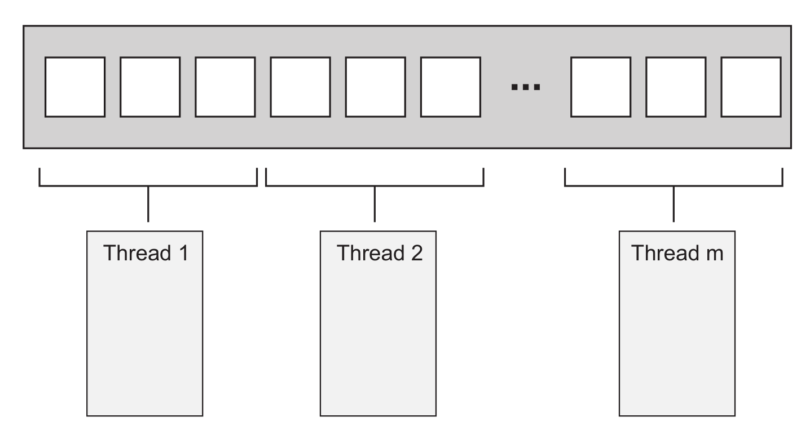
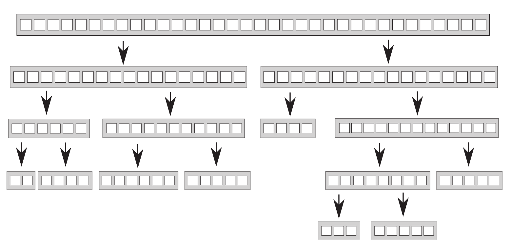

## 线程间的工作划分

* 为了提高线程利用率并最小化开销，必须决定要使用的线程数量，并为每个线程合理分配任务

### 开始处理之前的线程间数据划分

* 简单算法最容易并行化，比如要并行化 [std::for_each](https://en.cppreference.com/w/cpp/algorithm/for_each)，把元素划分到不同的线程上执行即可。如何划分才能获取最优性能，取决于数据结构的细节，这里用一个最简单的划分为例，每 N 个元素分配给一个线程，每个线程不需要与其他线程通信，直到独立完成各自的处理任务



* 如果使用过 [MPI](https://www.mpi-forum.org/) 或 [OpenMP](https://www.openmp.org/)，会很熟悉这个结构，即把一个任务划分成一系列并行任务，工作线程独立完成任务，最后 reduce 合并结果。不过对 for_each 来说，最后的 reduce 实际不需要执行操作，但对其他需要合并结果的并行算法来说，最后一步很重要
* 尽管这个技术很强大，但不是万能的，有时数据不能灵活划分，只有在处理数据时划分才明显，最能明显体现这点的就是递归算法，比如快速排序

### 递归划分数据

* 要并行化快速排序，无法直接划分数据，因为只有处理之后才知道某一项应该置于基数的哪一边。因此，很容易想到的是使用递归，其中的递归调用完全独立，各自处理不同的元素集，十分适合并发执行



* 如果数据集很大，为每个递归生成新线程就会生成大量线程，如果线程过多就会影响性能。因此需要严格控制线程数，不过这个问题可以直接抛给 [std::async](https://en.cppreference.com/w/cpp/thread/async)

```cpp
#include <algorithm>
#include <future>
#include <list>

template <typename T>
std::list<T> parallel_quick_sort(std::list<T> v) {
  if (v.empty()) {
    return {};
  }
  std::list<T> res;
  res.splice(res.begin(), v, v.begin());
  auto it = std::partition(v.begin(), v.end(),
                           [&](const T& x) { return x < res.front(); });
  std::list<T> low;
  low.splice(low.end(), v, v.begin(), it);
  std::future<std::list<T>> l(
      std::async(&parallel_quick_sort<T>, std::move(low)));
  auto r(parallel_quick_sort(std::move(v)));
  res.splice(res.end(), r);
  res.splice(res.begin(), l.get());
  return res;
}
```

* 也可以通过 [hardware_concurrency](https://en.cppreference.com/w/cpp/thread/thread/hardware_concurrency) 得知硬件可支持的线程数，再自己管理线程数。下面是一个使用 stack 存储已排序数据的并行快速排序

```cpp
#include <algorithm>
#include <atomic>
#include <future>
#include <list>
#include <memory>
#include <thread>
#include <vector>

#include "concurrent_stack.hpp"

template <typename T>
class Sorter {
 public:
  Sorter() : max_thread_count(std::thread::hardware_concurrency() - 1) {}

  ~Sorter() {
    end_of_data = true;
    for (auto& x : threads) {
      if (x.joinable()) {
        x.join();
      }
    }
  }

  std::list<T> do_sort(std::list<T>& v) {
    if (v.empty()) {
      return {};
    }
    std::list<T> res;
    res.splice(res.begin(), v, v.begin());
    auto it = std::partition(v.begin(), v.end(),
                             [&](const T& x) { return x < res.front(); });
    ChunkToSort low;
    low.data.splice(low.data.end(), v, v.begin(), it);
    std::future<std::list<T>> l = low.promise.get_future();
    chunks.push(std::move(low));
    if (threads.size() < max_thread_count) {
      threads.emplace_back(&Sorter<T>::sort_thread, this);
    }
    auto r{do_sort(v)};
    res.splice(res.end(), r);
    while (l.wait_for(std::chrono::seconds(0)) != std::future_status::ready) {
      try_sort_chunk();
    }
    res.splice(res.begin(), l.get());
    return res;
  }

 private:
  struct ChunkToSort {
    std::list<T> data;
    std::promise<std::list<T>> promise;
  };

 private:
  void sort_chunk(const std::shared_ptr<ChunkToSort>& chunk) {
    chunk->promise.set_value(do_sort(chunk->data));
  }

  void try_sort_chunk() {
    std::shared_ptr<ChunkToSort> chunk = chunks.pop();
    if (chunk) {
      sort_chunk(chunk);
    }
  }

  void sort_thread() {
    while (!end_of_data) {
      try_sort_chunk();
      std::this_thread::yield();
    }
  }

 private:
  ConcurrentStack<ChunkToSort> chunks;
  std::vector<std::thread> threads;
  const std::size_t max_thread_count;
  std::atomic<bool> end_of_data = false;
};

template <typename T>
std::list<T> parallel_quick_sort(std::list<T> v) {
  if (v.empty()) {
    return {};
  }
  return Sorter<T>{}.do_sort(v);
}
```

### 基于任务划分

* 如果数据动态生成或来自外部输入，上述划分方式都不适用，此时应该基于任务而非基于数据来划分。一种基于任务的划分方式是让线程针对性处理任务，对同一数据进行不同的操作，而不是都做相同的工作。这样线程是独立的，每个线程只需要负责完成总任务的某一部分。这就是 SoC（separation of concerns，关注点分离）设计原则
* 单线程中，如果有多个任务需要执行，只能依次执行任务，任务需要保存完成状态，并周期性地返回控制流给主循环。如果循环中添加了很多任务，就会导致程序变慢，对于一个用户发起的事件可能很久才会响应
* 这就是使用线程的原因，如果每个任务分离在线程上，保存状态和返回控制流给主循环这些事都抛给了操作系统，此时只需要关注任务本身，并且任务还可以并发运行，这样用户也能及时得到响应
* 但现实不一定这么顺利。如果任务都是独立的，线程之间不需要通信，那就很简单了。然而，这些后台运行的任务经常需要处理用户请求，因此就需要在完成时更新用户接口，以通知用户。此外，用户还可能想取消任务，这样就需要用户接口发送一条通知后台任务终止的消息。这些情况都要求周全的考虑和设计，以及合适的同步
* 虽然如此，但关注点仍然是分离的。用户接口线程线程仍处理用户接口，只是可能在被其他线程请求时要更新接口。同理，后台任务线程仍然关注自己的任务，只是允许被其他线程请求终止
* 多线程不是一定要 SoC，比如线程间有很多共享数据，或者需要互相等待。对于这样存在过多通信的线程，应该先找出通信的原因，如果所有的通信都关联同一个问题，合并成一个单线程来处理可能更好一些
* 基于任务划分不要求完全隔离，如果多个输入数据集合适用相同顺序的操作，可以把这个操作序列划分为多个子阶段来分配给每个线程，当一个线程完成操作后就把数据放进队列，供下一线程使用，这就是 pipeline。这也是另一种划分数据的方式，适用于操作开始前输入数据不是完全已知的情况，比如来自网络的数据或者扫描文件系统以识别要处理的文件
* 对于序列中耗时的操作，pipeline 就能提高响应速度。比如，如果操作包含 4 步，每步 5 秒，处理完一个数据就要 20秒，如果有 4 个包含整个操作的线程，虽然每 20 秒能处理 4 个数据，但每个数据仍要 20 秒处理。使用 pipeline，每个线程只处理一步，对于第一个数据需要 20 秒处理，之后处理每个数据都只需要 5 秒

```cpp
// 非 pipeline：每 20 秒 4 个数据（每个数据仍要 20 秒）
线程A：-1- -1- -1- -1- -5- -5- -5- -5-
线程B：-2- -2- -2- -2- -6- -6- -6- -6-
线程C：-3- -3- -3- -3- -7- -7- -7- -7-
线程D：-4- -4- -4- -4- -8- -8- -8- -8-

// pipeline：第一个数据 20 秒，之后每个 5 秒
线程A：-1- -2- -3- -4- -5- -6- -7- -8-
线程B：--- -1- -2- -3- -4- -5- -6- -7-
线程C：--- --- -1- -2- -3- -4- -5- -6-
线程D：--- --- --- -1- -2- -3- -4- -5-
```

* 以视频解码为例，每 4 秒 120 帧，第一秒达到 120 帧，卡顿 3 秒后播放下一个 120 帧，这样远不如稳定的每秒 30 帧

## 影响并发代码性能的因素

### 处理器数量

* 处理器数量是影响多线程程序性能的首要因素，一个并发程序在不同环境下的表现迥异，而开发者的环境和用户很可能不同，比如开发环境是双核或四核系统，但用户是任意多核或单核，因此必须谨慎考虑可能的影响并对其测试
* 单个 16 核、4 个四核、16 个单核是近似的，都能并发运行 16 个线程，要利用好这点，开发的程序必须至少用上 16 个线程。如果少于 16 个，就会浪费处理器性能（不考虑系统运行其他程序的情况），另一方面，如果多于 16 个，就会让处理器浪费时间在切换线程上，这种情况就是 oversubscription
* 使用 [hardware_concurrency](https://en.cppreference.com/w/cpp/thread/thread/hardware_concurrency) 可以获取硬件支持的线程数，但要注意它不会考虑已运行在系统上的其他线程，如果多个线程都用它给出的线程数，就会导致巨大的 oversubscription。这个问题可以抛给 [std::async](https://en.cppreference.com/w/cpp/thread/async)，它会适度处理并安排所有调用。这个问题也能用线程池解决
* 随着处理器数量增加，另一个影响性能的问题也随之而来，即多处理器尝试访问同一数据

### 乒乓缓存（cache ping-pong）

* 如果两个线程在不同处理器上并发执行，读取同一数据一般不会带来问题，数据将拷贝到它们的 cache，处理器可以同时处理。但如果一个线程修改数据，这个修改传给其他核的 cache 就需要花费时间，从而可能导致第二个处理器停止以等待改变传到内存硬件（取决于两个线程上的操作和这个操作使用的内存序）。从 CPU 指令的角度来看，这个操作慢到惊人，等价于数百个独立指令（具体取决于硬件的物理结构）

```cpp
std::atomic<std::size_t> n(0);

void f() {  // 任何线程都能调用
  // 每次n自增，处理器都要确保 cache 中的拷贝是最新的
  // 修改值后再告知其他处理器
  // fetch_add 是读改写操作，每次都要检索最新值
  // 如果另一线程在另一处理器运行此代码
  // n 的数据就要在两个处理器之间来回传递
  // 这样 n 增加时两个处理器的 cache 才能有最新值
  while (n.fetch_add(1, std::memory_order_relaxed) < 100000000) {
    task();  // 如果很快完成或者有很多处理器运行此代码，处理器就要互相等待
    // 一个处理器在更新值，另一个更新值的处理器就要等待
    // 直到第一个更新完成并把改变传过来
    // 这种情况就是 high contention
    // 反之处理器很少要互相等待的情况就是 low contention
    // 在类似这样的循环中，n 的数据在 cache 之间来回传递
    // 这就是 cache ping-pong
  }
}
```

* 如果处理器由于等待 cache 转移而挂起，就只能干等着而不能做任何工作。上例的情况可能不常见，但有一些和上例没有本质区别的常见情况，比如在循环中获取 mutex

```cpp
std::mutex m;

void f() {
  while (true) {
    std::lock_guard<std::mutex> l(m);  // 现在需要来回传递的是 m
    if (done_processing(data)) {
      break;
    }
  }
}
```

* 要避免乒乓缓存，就要尽量减少多个线程对同一内存位置的竞争。但即使一个特定内存位置只能被一个线程访问，仍然可能存在乒乓缓存，原因就是伪共享

### 伪共享（false sharing）

* 处理器 cache 不是独立的，而是以 cache line 作为最小单位，一般为 32 或 64 字节，因此小数据可能位于同一 cache line。有时这是好事，如果一个线程访问的数据都位于同一 cache line，性能会比分散在多个 cache line 好。但如果 cache line 中的数据项不相关，需要被多个线程访问，就会导致性能问题
* 假如有一个 int 数组，一组线程频繁访问和更新其中的数据。通常 int 大小不超过一个 cache line，因此一个 cache line 可以存储多个数据项，此时即使每个线程只访问自己需要的数据，cache 硬件也会造成乒乓缓存。比如访问 0 号数据的线程要更新数据，cache line 的所有权就要被转移到运行这个线程的处理器
* 数据可能不共享，但 cache line 是共享的，这就是伪共享。这个问题的解决方案是，构造数据，让能被同一线程访问的数据项位于内存中的临近位置，让能被不同线程访问的数据在内存中相距很远。C++17 提供了 [std::hardware_destructive_interference_size](https://en.cppreference.com/w/cpp/thread/hardware_destructive_interference_size) 来指定当前编译目标伪共享的最大连续字节数，只要数据间隔大于此字节数就可以避免伪共享

### data proximity

* 造成伪共享的原因是两个线程访问的数据过于接近，相应的，直接影响单线程的性能则是数据布局。如果单线程访问的数据分散在内存中，就类似位于不同的 cache line，如果在内存中十分靠近，就类似位于同一 cache line。如果数据是分散的，就需要从内存加载更多的 cache line 到处理器 cache，这就会增加内存访问延迟并降低性能
* 如果数据是分散的，一个包含当前线程数据的 cache line很可能会包含非当前线程的数据，极端情况下，cache 中将包含很多不需要的数据，这就会浪费宝贵的 cache 空间并增加处理器 cache miss 的概率，导致必须从主存获取数据。而这个数据可能曾在 cache 中保留过，但为了给其他数据让出空间必须从 cache 中移除
* 这看上去只对单线程很重要，但其实对多线程也很重要，原因在于任务切换（task switching）。如果线程数超过核数，就一定会有核要运行多线程，这就增加了 cache 的压力，因为为了避免伪共享必须确保不同的线程访问不同的 cache line，当处理器切换线程时，如果数据分散，很可能会重新载入 cache line。C++17 提供了[std::hardware_constructive_interference_size](https://en.cppreference.com/w/cpp/thread/hardware_destructive_interference_size) 来指定保证同一 cache line 的最大连续字节数，如果数据尺寸小于此字节数就能降低 cache miss 的几率
* 如果线程数超过处理器核数，操作系统可能会调度线程，在某个时间片上给一个核，在下一个时间片上给另一个核，这就要求把第一个核的 cache 传给第二个，从而增加了时间开销。虽然操作系统一般会尽量避免这点，但如果发生了就会对性能造成影响
* 当大量线程准备运行而非等待时，就会经常出现任务切换问题，这种处理器在任务切换上花费大量时间的情况就是 oversubscription

### oversubscription

* 线程经常花费时间来等待额外的 I/O、mutex 阻塞、条件变量，因此使用超过处理器核数的线程以确保没有闲置的处理器是合理的。但如果有过多的额外线程，操作系统确保为每个线程公平分配时间片，就会有沉重的任务切换负担。当一个任务重复而无限制地生成新线程，就会导致 oversubscription
* 如果生成的线程数过多的原因是数据划分，可以限制工作线程的数量。如果 oversubscription 是因为自然的工作划分，除了选择其他的划分方式，没有什么直接改善的办法。但选择合适的划分需要对目标平台有更多的了解，只有性能不可接受，而改变划分方式可以明显提高性能时才值得这样做
* 影响多线程代码性能的因素非常多，以上只是一些有明显可见影响的主要因素，比如乒乓缓存的开销在两个单核处理器和一个双核处理器上区别很大，即使两者有相同的CPU类型和时钟速度

## 适用多线程性能的数据结构

* 如果有两个上千行列的矩阵相乘，现在要用多线程来优化计算。一般非稀疏矩阵可以用一个大的一维数组表示，矩阵的每行在数组中连续排列。这个计算需要三个数组，其中一个存储计算结果。为了优化性能，就要仔细考虑数据访问模式，尤其是向结果数组的写入
* 划分方式有很多，如果行列数超过处理器数，每个线程可以计算结果的某些行或列，或者一个子矩阵
* 访问相邻元素可以减少对 cache 的使用，以及降低伪共享的概率。如果让线程计算结果的某列，就需要依次访问左矩阵的行（最终读取整个左矩阵），并读取右矩阵某列。矩阵保存于一维数组，行是相邻的，但列不是，因此写入结果时，其他线程可能访问同一行的其他元素。为了避免伪共享，需要让每行元素所占的空间正好是 cache line 的数量
* 如果让线程计算结果的某行，就需要读取左矩阵的某行，并依次读取右矩阵的列（最终读取整个右矩阵）。此时线程按行写入结果，由于一维数组里矩阵行是连续存储的，这个连续内存块不用被其他线程访问，比起上面按列写入结果是一个改进，伪共享只可能发生于一个结果块的最后几个元素与下一个块的前几个元素
* 如果划分为子矩阵，可以看成先按列划分再按行划分，因此它和按列划分一样存在伪共享的可能。如果可以避免这个可能，这个划分就有一个明显的好处，即不需要读取整个源矩阵，因此计算子矩阵比计算行好一些。当然，如果性能非常重要，必须针对目标架构 profile 各种选项并检索相关领域的文献
* 对于其他数据结构的数据访问模式进行优化时，需要考虑的本质上与优化对数组的访问类似
  * 调整线程间的数据分布，让同一线程访问的数据尽量紧密
  * 尽量减少线程所需的数据量
  * 依据 [std::hardware_destructive_interference_size](https://en.cppreference.com/w/cpp/thread/hardware_destructive_interference_size)，确保不同线程访问的数据距离足够远，以避免伪共享
* 这些用在其他数据结构上并不容易，比如二叉树很难在子树以外的任何单元中再分割，并且二叉树的节点一般是动态分配的，从而会分布在堆的不同位置上。数据位于堆的不同位置不是什么特别的问题，但确实意味着处理器需要在 cache 中保存更多东西。不过这是有益的，如果多个线程要遍历树，就都需要访问树节点，如果树节点只包含保存数据的指针，处理器只要在需要时从内存加载数据，如果数据被需要它的线程修改了，这能避免节点数据本身和提供树结构的数据之间的伪共享带来的性能问题
* 用 mutex 保护数据也有类似问题。假如有一个类，它包含一个 mutex 和一些被保护的数据，如果 mutex 和数据在内存中很接近，这对获取 mutex 的线程是很理想的，为了修改 mutex，需要的数据可能已经跟着加载在处理器 cache 中了。但这也有一个缺点，如果其他线程尝试获取 mutex，就会需要访问那块内存
* 互斥锁的典型实现为，一个操作在 mutex 内存位置上以尝试获取 mutex 的读改写原子操作，如果 mutex 已锁定，就接着调用操作系统内核。这个读改写操作可能会导致，持有该 mutex 的线程的 cache 中保存的数据无效。这对于 mutex 不是问题，在 mutex 解锁之前线程不会接触 mutex，但如果 mutex 与数据共享同一 cache line，另一个线程尝试获取 mutex 时，持有 mutex 的线程就会受到性能影响
* 一个测试这种伪共享是否会带来影响的方法是，在能被并发访问的数据之间添加巨大的填充块。比如用如下方式测试 mutex 竞争问题

```cpp
struct ProtectedData {
  std::mutex m;
  // 使用超过一个 cache line 字节数的填充即可
  char padding[std::hardware_destructive_interference_size];
  // 不支持 C++17 则可以 padding[65536];
  Data data_to_protect;
};
```

* 用如下方式测试数组数据伪共享，如果性能提高了就说明伪共享影响了性能，并且可以保留填充或者用其他方式重排数据访问来消除伪共享

```cpp
struct Data {
  data_item1 d1;
  data_item2 d2;
  char padding[std::hardware_destructive_interference_size];
};

Data some_array[256];
```

## 并发设计的其他注意事项

* 除了上述问题，设计并发代码时还需要考虑异常安全和可扩展性。如果代码不是异常安全的，就可能导致破坏不变量或 race condition，或由于一个操作抛出异常导致程序意外终止。可扩展性指的是，性能会随着处理器核数的提升而提升，如果处理器核数是之前的 100 倍，则最理想的情况下性能也应该之前的 100 倍

### 并发算法的异常安全

* 并行算法比串行算法更注重异常问题。在串行算法中，如果一个操作抛出异常，只需要保证吞下此异常以避免资源泄漏或破坏不变量，它可以愉快地允许异常传播给调用者处理。但在并行算法中，许多操作运行在不同的线程上，异常就不允许传播，因为它在错误的调用栈上。如果新线程上的函数存在异常，程序就会终止
* 回顾以前提到的并行版本的 [std::accumulate](https://en.cppreference.com/w/cpp/algorithm/accumulate)，它就是非异常安全的，代码可能抛出异常的位置如下

```cpp
#include <algorithm>
#include <functional>
#include <numeric>
#include <thread>
#include <vector>

template <typename Iterator, typename T>
struct accumulate_block {
  void operator()(Iterator first, Iterator last, T& res) {
    res = std::accumulate(first, last, res);  // 可能抛异常
  }
};

template <typename Iterator, typename T>
T parallel_accumulate(Iterator first, Iterator last, T init) {
  std::size_t len = std::distance(first, last);  // 此时没做任何事，抛异常无影响
  if (!len) {
    return init;
  }
  std::size_t min_per_thread = 25;
  std::size_t max_threads = (len + min_per_thread - 1) / min_per_thread;
  std::size_t hardware_threads = std::thread::hardware_concurrency();
  std::size_t num_threads =
      std::min(hardware_threads != 0 ? hardware_threads : 2, max_threads);
  std::size_t block_size = len / num_threads;
  std::vector<T> res(num_threads);  // 仍未做任何事，抛异常无影响
  std::vector<std::thread> threads(num_threads - 1);  // 同上
  Iterator block_start = first;                       // 同上
  for (std::size_t i = 0; i < num_threads - 1; ++i) {
    Iterator block_end = block_start;  // 同上
    std::advance(block_end, block_size);
    // 下面创建 std::thread，抛异常就导致析构对象，并调用 std::terminate
    // 终止程序
    threads[i] = std::thread(accumulate_block<Iterator, T>{}, block_start,
                             block_end, std::ref(res[i]));
    block_start = block_end;
  }
  // accumulate_block::operator() 调用的 std::accumulate
  // 可能抛异常，此时抛异常造成问题同上
  accumulate_block<Iterator, T>()(block_start, last, res[num_threads - 1]);
  std::for_each(threads.begin(), threads.end(),
                std::mem_fn(&std::thread::join));
  // 最后调用 std::accumulate 可能抛异常，但不引发大问题，因为所有线程已 join
  return std::accumulate(res.begin(), res.end(), init);
}
```

* 上面已经分析了所有可能抛出异常的位置，下面来处理这些问题。新线程想做的是返回计算结果，但可能抛出异常导致 [std::thread](https://en.cppreference.com/w/cpp/thread/thread) 析构，而析构没被 join 的 [std::thread](https://en.cppreference.com/w/cpp/thread/thread) 将导致程序终止。解决这个问题很简单，结合使用 [std::packaged_task](https://en.cppreference.com/w/cpp/thread/packaged_task) 和 [std::future](https://en.cppreference.com/w/cpp/thread/future)，再把工作线程的异常抛出到主线程，让主线程处理即可

```cpp
#include <algorithm>
#include <functional>
#include <future>
#include <numeric>
#include <thread>
#include <vector>

template <typename Iterator, typename T>
struct accumulate_block {
  T operator()(Iterator first, Iterator last) {
    return std::accumulate(first, last, T{});
  }
};

template <typename Iterator, typename T>
T parallel_accumulate(Iterator first, Iterator last, T init) {
  std::size_t len = std::distance(first, last);
  if (!len) {
    return init;
  }
  std::size_t min_per_thread = 25;
  std::size_t max_threads = (len + min_per_thread - 1) / min_per_thread;
  std::size_t hardware_threads = std::thread::hardware_concurrency();
  std::size_t num_threads =
      std::min(hardware_threads != 0 ? hardware_threads : 2, max_threads);
  std::size_t block_size = len / num_threads;
  std::vector<std::future<T>> fts(num_threads - 1);  // 改用 std::future 获取值
  std::vector<std::thread> threads(num_threads - 1);
  Iterator block_start = first;
  for (std::size_t i = 0; i < num_threads - 1; ++i) {
    Iterator block_end = block_start;
    std::advance(block_end, block_size);
    // 用 std::packaged_task 替代直接创建 std::thread
    std::packaged_task<T(Iterator, Iterator)> pt(
        accumulate_block<Iterator, T>{});
    fts[i] = pt.get_future();
    threads[i] = std::thread(std::move(pt), block_start, block_end);
    block_start = block_end;
  }
  T last_res = accumulate_block<Iterator, T>{}(block_start, last);
  std::for_each(threads.begin(), threads.end(),
                std::mem_fn(&std::thread::join));
  T res = init;
  try {
    for (std::size_t i = 0; i < num_threads - 1; ++i) {
      res += fts[i].get();
    }
    res += last_res;
  } catch (...) {
    for (auto& x : threads) {
      if (x.joinable()) {
        x.join();
      }
    }
    throw;
  }
  return res;
}
```

* 不过 try-catch 很难看，并且导致了重复代码（正常控制流和 catch 块都对线程执行 join），因此可以用 RAII 来处理

```cpp
#include <algorithm>
#include <functional>
#include <future>
#include <numeric>
#include <thread>
#include <vector>

class threads_guard {
 public:
  explicit threads_guard(std::vector<std::thread>& threads)
      : threads_(threads) {}

  ~threads_guard() {
    for (auto& x : threads_) {
      if (x.joinable()) {
        x.join();
      }
    }
  }

 private:
  std::vector<std::thread>& threads_;
};

template <typename Iterator, typename T>
struct accumulate_block {
  T operator()(Iterator first, Iterator last) {
    return std::accumulate(first, last, T{});
  }
};

template <typename Iterator, typename T>
T parallel_accumulate(Iterator first, Iterator last, T init) {
  std::size_t len = std::distance(first, last);
  if (!len) {
    return init;
  }
  std::size_t min_per_thread = 25;
  std::size_t max_threads = (len + min_per_thread - 1) / min_per_thread;
  std::size_t hardware_threads = std::thread::hardware_concurrency();
  std::size_t num_threads =
      std::min(hardware_threads != 0 ? hardware_threads : 2, max_threads);
  std::size_t block_size = len / num_threads;
  std::vector<std::future<T>> fts(num_threads - 1);
  std::vector<std::thread> threads(num_threads - 1);
  threads_guard g{threads};  // threads 元素析构时自动 join
  Iterator block_start = first;
  for (std::size_t i = 0; i < num_threads - 1; ++i) {
    Iterator block_end = block_start;
    std::advance(block_end, block_size);
    std::packaged_task<T(Iterator, Iterator)> pt(
        accumulate_block<Iterator, T>{});
    fts[i] = pt.get_future();
    threads[i] = std::thread(std::move(pt), block_start, block_end);
    block_start = block_end;
  }
  T last_res = accumulate_block<Iterator, T>{}(block_start, last);
  std::for_each(threads.begin(), threads.end(),
                std::mem_fn(&std::thread::join));
  T res = init;
  for (std::size_t i = 0; i < num_threads - 1; ++i) {
    res += fts[i].get();
  }
  res += last_res;
  return res;
}
```

* C++20 引入了能自动析构的 [std::jthread](https://en.cppreference.com/w/cpp/thread/jthread)

```cpp
#include <algorithm>
#include <functional>
#include <future>
#include <numeric>
#include <thread>
#include <vector>

template <typename Iterator, typename T>
struct accumulate_block {
  T operator()(Iterator first, Iterator last) {
    return std::accumulate(first, last, T{});
  }
};

template <typename Iterator, typename T>
T parallel_accumulate(Iterator first, Iterator last, T init) {
  std::size_t len = std::distance(first, last);
  if (!len) {
    return init;
  }
  std::size_t min_per_thread = 25;
  std::size_t max_threads = (len + min_per_thread - 1) / min_per_thread;
  std::size_t hardware_threads = std::thread::hardware_concurrency();
  std::size_t num_threads =
      std::min(hardware_threads != 0 ? hardware_threads : 2, max_threads);
  std::size_t block_size = len / num_threads;
  std::vector<std::future<T>> fts(num_threads - 1);
  std::vector<std::jthread> threads(num_threads - 1);
  Iterator block_start = first;
  for (std::size_t i = 0; i < num_threads - 1; ++i) {
    Iterator block_end = block_start;
    std::advance(block_end, block_size);
    std::packaged_task<T(Iterator, Iterator)> pt(
        accumulate_block<Iterator, T>{});
    fts[i] = pt.get_future();
    threads[i] = std::jthread(std::move(pt), block_start, block_end);
    block_start = block_end;
  }
  T last_res = accumulate_block<Iterator, T>{}(block_start, last);
  std::for_each(threads.begin(), threads.end(),
                std::mem_fn(&std::jthread::join));
  T res = init;
  for (std::size_t i = 0; i < num_threads - 1; ++i) {
    res += fts[i].get();
  }
  res += last_res;
  return res;
}
```

* 更优雅的方式是使用 [std::async](https://en.cppreference.com/w/cpp/thread/async)

```cpp
#include <future>
#include <numeric>

template <typename Iterator, typename T>
T parallel_accumulate(Iterator first, Iterator last, T init) {
  std::size_t len = std::distance(first, last);
  std::size_t max_chunk_size = 25;
  if (len <= max_chunk_size) {
    return std::accumulate(first, last, init);
  }
  Iterator mid_point = first;
  std::advance(mid_point, len / 2);
  std::future<T> l =
      std::async(parallel_accumulate<Iterator, T>, first, mid_point, init);
  // 递归调用如果抛出异常，std::async 创建的 std::future 将在异常传播时被析构
  T r = parallel_accumulate(mid_point, last, T{});
  // 如果异步任务抛出异常，get 就会捕获异常并重新抛出
  return l.get() + r;
}
```

### 可扩展性与阿姆达尔定律（Amdahl’s law）

* 可扩展性代表了程序对处理器的利用率。单线程程序就是不可扩展的，因为处理器增加完全不能提高单线程程序的性能。对于多线程程序，线程经常需要花费时间等待（等待其他线程、获取 mutex、修改条件变量、完成 I/O 操作......），一种简化看待多线程程序的方式是将其分为串行和并行部分，由此可以得到如下公式，即阿姆达尔定律

```cpp
S = 1 / (a + ( 1 - a ) / N) // a 为串行部分占比，N 为处理器倍数，S 为性能倍数
// 正常情况下 S < 1 / a，最理想的情况是 a 为 0，S = N
```

### 用多线程隐藏延迟（lantency）

* 如果在线程等待期间让系统做一些有用的事，就相当于隐藏了等待。如果只有和处理器单元一样多的线程，阻塞就意味着浪费 CPU 时间，因此可以利用这个时间去运行额外的线程。比如一个用 pipeline 划分工作的病毒扫描程序，一个线程检索文件系统并将文件放入队列，这是一个费时的 I/O 操作，因此同时可以让另一线程从队列获取文件名，加载并扫描文件
* 利用空闲的 CPU 时间也可能不需要运行额外的线程。比如，如果一个线程因为等待 I/O 操作而阻塞，使用异步 I/O 就是合理的，当 I/O 操作异步运行在后台时，线程就能做有用的工作。又比如，一个线程等待另一线程执行一个操作时，与其阻塞，不如自己执行操作（如lock-free queue）。更极端的例子是，如果线程等待一个未被任何线程启动的任务完成，这个线程可能自己执行此任务，或执行另一个未完成的任务

### 用并发提高响应度（responsiveness）

* 添加线程不一定是为了确保使用所有可用的处理器，有时是为了确保及时处理外部事件，以提高系统响应度。现代 GUI 框架大多是事件驱动的，为了确保处理所有事件和消息，GUI 程序一般包含一个如下循环

```cpp
while (true) {
  event_data event = get_event();
  if (event.type == quit) {
    break;
  }
  process(event);
}
```

* 如果是单线程程序，就很难编写长期运行的任务。为了确保即使响应用户输入，就要以合理频率调用 get_event 和 process，这意味着任务要被周期性悬挂（suspend）并把控制流返回给事件循环，或者在代码中的一个适当点调用 get_event 和 process，二者任一都会复杂化任务实现
* 通过 SoC（separation of concerns）可以把很长的任务放在一个全新的线程上，而让 GUI 线程来处理事件，线程可以通过简单的机制进行通信，而不需要混入处理事件的代码，这样即使任务耗费很长时间，用户线程也总能及时响应事件

```cpp
std::thread task_thread;
std::atomic<bool> task_cancelled(false);

void gui_thread() {
  while (true) {
    event_data event = get_event();
    if (event.type == quit) {
      break;
    }
    process(event);
  }
}

void task() {
  while (!task_complete() && !task_cancelled) do_next_operation();
  if (task_cancelled) {
    perform_cleanup();
  } else {
    post_gui_event(task_complete);
  }
}

void process(const event_data& event) {
  switch (event.type) {
    case start_task:
      task_cancelled = false;
      task_thread = std::thread(task);
      break;
    case stop_task:
      task_cancelled = true;
      task_thread.join();
      break;
    case task_complete:
      task_thread.join();
      display_results();
      break;
    default:
      ...
  }
}
```

## 实践

* 下面为标准库的三个算法实现并行版本，这些实现仅是为了阐述技术的运用，而不是最先进高效的实现。更先进的实现可以在学术文献或专业的多线程库（如 [Intel 的 Threading Building Blocks](https://github.com/intel/tbb)） 中找到

### 并行版 [std::for_each](https://en.cppreference.com/w/cpp/algorithm/for_each)

* [std::for_each](https://en.cppreference.com/w/cpp/algorithm/for_each) 会按顺序依次作用于每个元素，而并行版不保证顺序，元素最好被并发处理，为此需要把元素划分给每个线程。实际上，并行版 [std::for_each](https://en.cppreference.com/w/cpp/algorithm/for_each) 与并行版 [std::accumulate](https://en.cppreference.com/w/cpp/algorithm/accumulate)的实现思路基本一样：使用 [hardware_concurrency](https://en.cppreference.com/w/cpp/thread/thread/hardware_concurrency) 决定线程数，使用连续数据块避免伪共享，使用 [std::packaged_task](https://en.cppreference.com/w/cpp/thread/packaged_task) 和 [std::future](https://en.cppreference.com/w/cpp/thread/future) 在线程间传递异常

```cpp
#include <algorithm>
#include <future>
#include <thread>
#include <vector>

template <typename Iterator, typename Func>
void parallel_for_each(Iterator first, Iterator last, Func f) {
  std::size_t len = std::distance(first, last);
  if (!len) {
    return;
  }
  std::size_t min_per_thread = 25;
  std::size_t max_threads = (len + min_per_thread - 1) / min_per_thread;
  std::size_t hardware_threads = std::thread::hardware_concurrency();
  std::size_t num_threads =
      std::min(hardware_threads != 0 ? hardware_threads : 2, max_threads);
  std::size_t block_size = len / num_threads;
  std::vector<std::future<void>> fts(num_threads - 1);
  std::vector<std::jthread> threads(num_threads - 1);
  Iterator block_start = first;
  for (std::size_t i = 0; i < num_threads - 1; ++i) {
    Iterator block_end = block_start;
    std::advance(block_end, block_size);
    std::packaged_task<void(void)> pt(
        [=] { std::for_each(block_start, block_end, f); });
    fts[i] = pt.get_future();
    threads[i] = std::jthread(std::move(pt));
    block_start = block_end;
  }
  std::for_each(block_start, last, f);
  for (std::size_t i = 0; i < num_threads - 1; ++i) {
    fts[i].get();  // 只是为了传递异常
  }
}
```

* 也可以使用 [std::async](https://en.cppreference.com/w/cpp/thread/async) 来简化实现

```cpp
#include <algorithm>
#include <future>

template <typename Iterator, typename Func>
void parallel_for_each(Iterator first, Iterator last, Func f) {
  std::size_t len = std::distance(first, last);
  if (!len) {
    return;
  }
  std::size_t min_per_thread = 25;
  if (len < 2 * min_per_thread) {
    std::for_each(first, last, f);
    return;
  }
  const Iterator mid_point = first + len / 2;
  std::future<void> l =
      std::async(&parallel_for_each<Iterator, Func>, first, mid_point, f);
  parallel_for_each(mid_point, last, f);
  l.get();
}
```

### 并行版 [std::find](https://en.cppreference.com/w/cpp/algorithm/find)

* [std::find](https://en.cppreference.com/w/cpp/algorithm/find) 的不同之处在于，只要找到目标值就应该停止继续查找。在并行版本中，一个线程找到了值，不仅自身要停止继续查找，还应该通知其他线程停止，这点可以使用一个原子变量作为标记来实现
* 有两种可选方式来返回值和传播异常，一是使用 [std::future](https://en.cppreference.com/w/cpp/thread/future) 数组和 [std::packaged_task](https://en.cppreference.com/w/cpp/thread/packaged_task) 将返回值和异常交给主线程处理，二是使用 [std::promise](https://en.cppreference.com/w/cpp/thread/promise) 直接设置最终结果。如果想在首个异常上终止（即使没有处理完所有元素）则使用 [std::promise](https://en.cppreference.com/w/cpp/thread/promise)，如果想让其他线程继续搜索则使用 [std::packaged_task](https://en.cppreference.com/w/cpp/thread/packaged_task) 保存所有异常，并在没有找到目标值时重新抛出其中一个异常。这里选择使用行为更接近 [std::find](https://en.cppreference.com/w/cpp/algorithm/find) 的 [std::promise](https://en.cppreference.com/w/cpp/thread/promise)

```cpp
#include <algorithm>
#include <atomic>
#include <functional>
#include <future>
#include <numeric>
#include <thread>
#include <vector>

template <typename Iterator, typename T>
Iterator parallel_find(Iterator first, Iterator last, T match) {
  struct find_element {
    void operator()(Iterator begin, Iterator end, T match,
                    std::promise<Iterator>* res, std::atomic<bool>* done_flag) {
      try {
        for (; begin != end && !done_flag->load(); ++begin) {
          if (*begin == match) {
            res->set_value(begin);
            done_flag->store(true);
            return;
          }
        }
      } catch (...) {
        try {
          res->set_exception(std::current_exception());
          done_flag->store(true);
        } catch (...) {
        }
      }
    }
  };

  std::size_t len = std::distance(first, last);
  if (!len) {
    return last;
  }
  std::size_t min_per_thread = 25;
  std::size_t max_threads = (len + min_per_thread - 1) / min_per_thread;
  std::size_t hardware_threads = std::thread::hardware_concurrency();
  std::size_t num_threads =
      std::min(hardware_threads != 0 ? hardware_threads : 2, max_threads);
  std::size_t block_size = len / num_threads;
  std::promise<Iterator> res;
  std::atomic<bool> done_flag(false);
  {
    std::vector<std::jthread> threads(num_threads - 1);
    Iterator block_start = first;
    for (auto& x : threads) {
      Iterator block_end = block_start;
      std::advance(block_end, block_size);
      x = std::jthread(find_element{}, block_start, block_end, match, &res,
                       &done_flag);
      block_start = block_end;
    }
    find_element{}(block_start, last, match, &res, &done_flag);
  }
  if (!done_flag.load()) {
    return last;
  }
  return res.get_future().get();
}
```

* 也可以使用 [std::async](https://en.cppreference.com/w/cpp/thread/async) 实现

```cpp
#include <atomic>
#include <future>

template <typename Iterator, typename T>
Iterator parallel_find_impl(Iterator first, Iterator last, T match,
                            std::atomic<bool>& done_flag) {
  try {
    std::size_t len = std::distance(first, last);
    std::size_t min_per_thread = 25;
    if (len < (2 * min_per_thread)) {
      for (; first != last && !done_flag.load(); ++first) {
        if (*first == match) {
          done_flag = true;
          return first;
        }
      }
      return last;
    }
    const Iterator mid_point = first + len / 2;
    std::future<Iterator> async_res =
        std::async(&parallel_find_impl<Iterator, T>, mid_point, last, match,
                   std::ref(done_flag));
    const Iterator direct_res =
        parallel_find_impl(first, mid_point, match, done_flag);
    return direct_res == mid_point ? async_res.get() : direct_res;
  } catch (...) {
    done_flag = true;
    throw;
  }
}

template <typename Iterator, typename T>
Iterator parallel_find(Iterator first, Iterator last, T match) {
  std::atomic<bool> done_flag(false);
  return parallel_find_impl(first, last, match, done_flag);
}
```

### 并行版 [std::partial_sum](https://en.cppreference.com/w/cpp/algorithm/partial_sum)

* [std::partial_sum](https://en.cppreference.com/w/cpp/algorithm/partial_sum) 会依次累加元素的和（默认是加，也可以是其他二元操作）

```cpp
#include <numeric>
#include <vector>

int main() {
  std::vector<int> v{1, 2, 3, 4};
  std::partial_sum(
      v.begin(), v.end(),
      std::ostream_iterator<int>(std::cout << "hi"),  // 输出到的迭代器起始位置
      std::plus<int>{});  // 使用的二元运算符，不指定则默认累加
}  // 输出 hi13610
```

* 其实现为

```cpp
template <class InputIt, class OutputIt, class BinaryOperation>
OutputIt partial_sum(InputIt first, InputIt last, OutputIt d_first,
                     BinaryOperation op) {
  if (first == last) {
    return d_first;
  }
  typename std::iterator_traits<InputIt>::value_type sum = *first;
  *d_first = sum;
  while (++first != last) {
    sum = op(std::move(sum), *first);
    *++d_first = sum;
  }
  return ++d_first;
}
```

* 实现并行版本时，第一种划分方式就是传统的按块划分

```cpp
1 1 1 1 1 1 1 1 1 // 输入 9 个 1
// 划分为三部分
1 1 1
1 1 1
1 1 1
// 得到三个部分的结果
1 2 3
1 2 3
1 2 3
// 将第一部分的尾元素（即 3）加到第二部分
1 2 3
4 5 6
1 2 3
// 再将第二部分的尾元素（即 6）加到第三部分
1 2 3
4 5 6
7 8 9
```

* 由于需要线程间同步，这个实现不容易简单地用 [std::async](https://en.cppreference.com/w/cpp/thread/async) 重写

```cpp
#include <algorithm>
#include <future>
#include <numeric>

template <typename Iterator>
void parallel_partial_sum(Iterator first, Iterator last) {
  using value_type = typename Iterator::value_type;
  struct process_chunk {
    void operator()(Iterator begin, Iterator last,
                    std::future<value_type>* previous_end_value,
                    std::promise<value_type>* end_value) {
      try {
        Iterator end = last;
        ++end;
        std::partial_sum(begin, end, begin);
        if (previous_end_value) {  // 不是第一个块
          value_type addend = previous_end_value->get();
          *last += addend;
          if (end_value) {
            end_value->set_value(*last);
          }
          std::for_each(begin, last,
                        [addend](value_type& item) { item += addend; });
        } else if (end_value) {
          end_value->set_value(*last);  // 是第一个块则可以为下个块更新尾元素
        }
      } catch (...) {
        // 如果抛出异常则存储到
        // std::promise，异常会传播给下一个块（获取这个块的尾元素时）
        if (end_value) {
          end_value->set_exception(std::current_exception());
        } else {
          throw;  // 异常最终传给最后一个块，此时再抛出异常
        }
      }
    }
  };

  std::size_t len = std::distance(first, last);
  if (!len) {
    return;
  }
  std::size_t min_per_thread = 25;
  std::size_t max_threads = (len + min_per_thread - 1) / min_per_thread;
  std::size_t hardware_threads = std::thread::hardware_concurrency();
  std::size_t num_threads =
      std::min(hardware_threads != 0 ? hardware_threads : 2, max_threads);
  std::size_t block_size = len / num_threads;
  // end_values 存储块内尾元素值
  std::vector<std::promise<value_type>> end_values(num_threads - 1);
  // prev_end_values 检索前一个块的尾元素
  std::vector<std::future<value_type>> prev_end_values;
  prev_end_values.reserve(num_threads - 1);
  Iterator block_start = first;
  std::vector<std::jthread> threads(num_threads - 1);
  for (std::size_t i = 0; i < num_threads - 1; ++i) {
    Iterator block_last = block_start;
    std::advance(block_last, block_size - 1);  // 指向尾元素
    threads[i] = std::jthread(process_chunk{}, block_start, block_last,
                              i != 0 ? &prev_end_values[i - 1] : nullptr,
                              &end_values[i]);
    block_start = block_last;
    ++block_start;
    prev_end_values.emplace_back(end_values[i].get_future());
  }
  Iterator final_element = block_start;
  std::advance(final_element, std::distance(block_start, last) - 1);
  process_chunk{}(block_start, final_element,
                  num_threads > 1 ? &prev_end_values.back() : nullptr, nullptr);
}
```

* 如果处理器核数非常多，就没必要使用上面的方式了，因为还有并发度更高的方式，即隔一定距离计算，每轮计算完成，下一轮计算使用的距离变为之前的两倍。这种方式不再需要进一步同步，因为所有中间的结果都直接传给了下一个需要这些结果的处理器，但实际上很少有处理器可以在多条数据上同时执行同一条指令（即 SIMD），因此必须为通用情况设计代码，在每步操作上显式同步线程，比如使用 barrier 的同步机制，直到所有线程到达 barrier 时才能继续执行下一步

```cpp
1 1 1 1 1 1 1 1 1 // 输入 9 个 1
// 先让距离为 1 的元素相加
1 2 2 2 2 2 2 2 2
// 再让距离为 2 的元素相加
1 2 3 4 4 4 4 4 4
// 再让距离为 4 的元素相加
1 2 3 4 5 6 7 8 8
// 再让距离为 8 的元素相加
1 2 3 4 5 6 7 8 9
```
