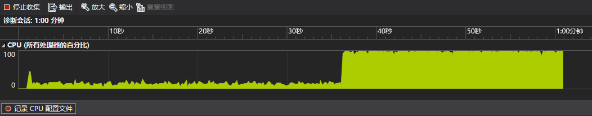
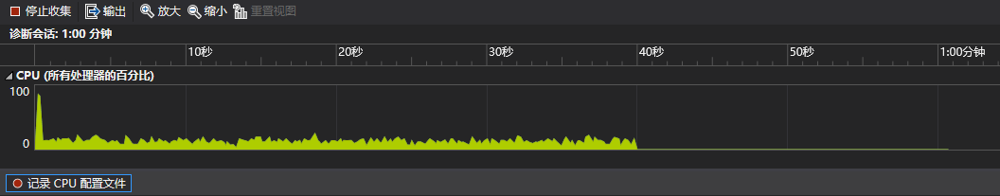

## 线程池

* 线程池一般会用一个表示线程数的参数来初始化，内部需要一个队列来存储任务。下面是一个最简单的线程池实现

```cpp
#include <condition_variable>
#include <functional>
#include <mutex>
#include <queue>
#include <thread>
#include <utility>

class ThreadPool {
 public:
  explicit ThreadPool(std::size_t n) {
    for (std::size_t i = 0; i < n; ++i) {
      std::thread{[this] {
        std::unique_lock<std::mutex> l(m_);
        while (true) {
          if (!q_.empty()) {
            auto task = std::move(q_.front());
            q_.pop();
            l.unlock();
            task();
            l.lock();
          } else if (done_) {
            break;
          } else {
            cv_.wait(l);
          }
        }
      }}.detach();
    }
  }

  ~ThreadPool() {
    {
      std::lock_guard<std::mutex> l(m_);
      done_ = true;  // cv_.wait 使用了 done_ 判断所以要加锁
    }
    cv_.notify_all();
  }

  template <typename F>
  void submit(F&& f) {
    {
      std::lock_guard<std::mutex> l(m_);
      q_.emplace(std::forward<F>(f));
    }
    cv_.notify_one();
  }

 private:
  std::mutex m_;
  std::condition_variable cv_;
  bool done_ = false;
  std::queue<std::function<void()>> q_;
};
```

* 如果想让提交的任务带参数会麻烦很多

```cpp
template <class F, class... Args>
auto ThreadPool::submit(F&& f, Args&&... args) {
  using RT = std::invoke_result_t<F, Args...>;
  // std::packaged_task 不允许拷贝构造，不能直接传入 lambda，
  // 因此要借助 std::shared_ptr
  auto task = std::make_shared<std::packaged_task<RT()>>(
      std::bind(std::forward<F>(f), std::forward<Args>(args)...));
  // 但 std::bind 会按值拷贝实参，因此这个实现不允许任务的实参是 move-only 类型
  {
    std::lock_guard<std::mutex> l(m_);
    q_.emplace([task]() { (*task)(); });  // 捕获指针以传入 std::packaged_task
  }
  cv_.notify_one();
  return task->get_future();
}
```

* 书上实现的线程池都在死循环中使用了 [std::this_thread::yield](https://en.cppreference.com/w/cpp/thread/yield) 来转让时间片

```cpp
#include <atomic>
#include <functional>
#include <thread>
#include <vector>

#include "concurrent_queue.hpp"

class ThreadPool {
 public:
  ThreadPool() {
    std::size_t n = std::thread::hardware_concurrency();
    try {
      for (std::size_t i = 0; i < n; ++i) {
        threads_.emplace_back(&ThreadPool::worker_thread, this);
      }
    } catch (...) {
      done_ = true;
      for (auto& x : threads_) {
        if (x.joinable()) {
          x.join();
        }
      }
      throw;
    }
  }

  ~ThreadPool() {
    done_ = true;
    for (auto& x : threads_) {
      if (x.joinable()) {
        x.join();
      }
    }
  }

  template <typename F>
  void submit(F f) {
    q_.push(std::function<void()>(f));
  }

 private:
  void worker_thread() {
    while (!done_) {
      std::function<void()> task;
      if (q_.try_pop(task)) {
        task();
      } else {
        std::this_thread::yield();
      }
    }
  }

 private:
  std::atomic<bool> done_ = false;
  ConcurrentQueue<std::function<void()>> q_;
  std::vector<std::thread> threads_;  // 要在 done_ 和 q_ 之后声明
};
```

* 这样做的问题是，如果线程池处于空闲状态，就会无限转让时间片，导致 CPU 使用率达 100%，下面是对书中的线程池的 CPU 使用率测试结果



* 对相同任务用之前实现的线程池的测试结果



* 这里还是把书上的内容列出来，下文均为书中内容
* 这个线程池只能执行无参数无返回值的函数，并且可能出现死锁，下面希望能执行无参数但有返回值的函数。为了得到返回值，就应该把函数传递给 [std::packaged_task](https://en.cppreference.com/w/cpp/thread/packaged_task) 再加入队列，并返回 [std::packaged_task](https://en.cppreference.com/w/cpp/thread/packaged_task) 中的 [std::future](https://en.cppreference.com/w/cpp/thread/future)。由于 [std::packaged_task](https://en.cppreference.com/w/cpp/thread/packaged_task) 是 move-only 类型，而 [std::function](https://en.cppreference.com/w/cpp/utility/functional/function) 要求存储的函数实例可以拷贝构造，因此这里需要实现一个支持 move-only 类型的函数包裹类，即一个带 call 操作的类型擦除（type-erasure）类

```cpp
#include <memory>
#include <utility>

class FunctionWrapper {
 public:
  FunctionWrapper() = default;

  FunctionWrapper(const FunctionWrapper&) = delete;

  FunctionWrapper& operator=(const FunctionWrapper&) = delete;

  FunctionWrapper(FunctionWrapper&& rhs) noexcept
      : impl_(std::move(rhs.impl_)) {}

  FunctionWrapper& operator=(FunctionWrapper&& rhs) noexcept {
    impl_ = std::move(rhs.impl_);
    return *this;
  }

  template <typename F>
  FunctionWrapper(F&& f) : impl_(new ImplType<F>(std::move(f))) {}

  void operator()() const { impl_->call(); }

 private:
  struct ImplBase {
    virtual void call() = 0;
    virtual ~ImplBase() = default;
  };

  template <typename F>
  struct ImplType : ImplBase {
    ImplType(F&& f) noexcept : f_(std::move(f)) {}
    void call() override { f_(); }

    F f_;
  };

 private:
  std::unique_ptr<ImplBase> impl_;
};
```

* 用这个包裹类替代 `std::function<void()>`

```cpp
#include <atomic>
#include <future>
#include <thread>
#include <type_traits>
#include <vector>

#include "concurrent_queue.hpp"
#include "function_wrapper.hpp"

class ThreadPool {
 public:
  ThreadPool() {
    std::size_t n = std::thread::hardware_concurrency();
    try {
      for (std::size_t i = 0; i < n; ++i) {
        threads_.emplace_back(&ThreadPool::worker_thread, this);
      }
    } catch (...) {
      done_ = true;
      for (auto& x : threads_) {
        if (x.joinable()) {
          x.join();
        }
      }
      throw;
    }
  }

  ~ThreadPool() {
    done_ = true;
    for (auto& x : threads_) {
      if (x.joinable()) {
        x.join();
      }
    }
  }

  template <typename F>
  std::future<std::invoke_result_t<F>> submit(F f) {
    std::packaged_task<std::invoke_result_t<F>()> task(std::move(f));
    std::future<std::invoke_result_t<F>> res(task.get_future());
    q_.push(std::move(task));
    return res;
  }

 private:
  void worker_thread() {
    while (!done_) {
      FunctionWrapper task;
      if (q_.try_pop(task)) {
        task();
      } else {
        std::this_thread::yield();
      }
    }
  }

 private:
  std::atomic<bool> done_ = false;
  ConcurrentQueue<FunctionWrapper> q_;
  std::vector<std::thread> threads_;  // 要在 done_ 和 q_ 之后声明
};
```

* 往线程池添加任务会增加任务队列的竞争，lock-free 队列可以避免这点但存在乒乓缓存的问题。为此需要把任务队列拆分为线程独立的本地队列和全局队列，当线程队列无任务时就去全局队列取任务

```cpp
#include <atomic>
#include <future>
#include <memory>
#include <queue>
#include <thread>
#include <type_traits>
#include <vector>

#include "concurrent_queue.hpp"
#include "function_wrapper.hpp"

class ThreadPool {
 public:
  ThreadPool() {
    std::size_t n = std::thread::hardware_concurrency();
    try {
      for (std::size_t i = 0; i < n; ++i) {
        threads_.emplace_back(&ThreadPool::worker_thread, this);
      }
    } catch (...) {
      done_ = true;
      for (auto& x : threads_) {
        if (x.joinable()) {
          x.join();
        }
      }
      throw;
    }
  }

  ~ThreadPool() {
    done_ = true;
    for (auto& x : threads_) {
      if (x.joinable()) {
        x.join();
      }
    }
  }

  template <typename F>
  std::future<std::invoke_result_t<F>> submit(F f) {
    std::packaged_task<std::invoke_result_t<F>()> task(std::move(f));
    std::future<std::invoke_result_t<F>> res(task.get_future());
    if (local_queue_) {
      local_queue_->push(std::move(task));
    } else {
      pool_queue_.push(std::move(task));
    }
    return res;
  }

 private:
  void worker_thread() {
    local_queue_.reset(new std::queue<FunctionWrapper>);
    while (!done_) {
      FunctionWrapper task;
      if (local_queue_ && !local_queue_->empty()) {
        task = std::move(local_queue_->front());
        local_queue_->pop();
        task();
      } else if (pool_queue_.try_pop(task)) {
        task();
      } else {
        std::this_thread::yield();
      }
    }
  }

 private:
  std::atomic<bool> done_ = false;
  ConcurrentQueue<FunctionWrapper> pool_queue_;
  inline static thread_local std::unique_ptr<std::queue<FunctionWrapper>>
      local_queue_;
  std::vector<std::thread> threads_;
};
```

* 这可以避免数据竞争，但如果任务分配不均，就会导致某个线程的本地队列中有很多任务，而其他线程无事可做，为此应该让没有工作的线程可以从其他线程获取任务

```cpp
#include <atomic>
#include <deque>
#include <future>
#include <memory>
#include <mutex>
#include <thread>
#include <type_traits>
#include <vector>

#include "concurrent_queue.hpp"
#include "function_wrapper.hpp"

class WorkStealingQueue {
 public:
  WorkStealingQueue() = default;

  WorkStealingQueue(const WorkStealingQueue&) = delete;

  WorkStealingQueue& operator=(const WorkStealingQueue&) = delete;

  void push(FunctionWrapper f) {
    std::lock_guard<std::mutex> l(m_);
    q_.push_front(std::move(f));
  }

  bool empty() const {
    std::lock_guard<std::mutex> l(m_);
    return q_.empty();
  }

  bool try_pop(FunctionWrapper& res) {
    std::lock_guard<std::mutex> l(m_);
    if (q_.empty()) {
      return false;
    }
    res = std::move(q_.front());
    q_.pop_front();
    return true;
  }

  bool try_steal(FunctionWrapper& res) {
    std::lock_guard<std::mutex> l(m_);
    if (q_.empty()) {
      return false;
    }
    res = std::move(q_.back());
    q_.pop_back();
    return true;
  }

 private:
  std::deque<FunctionWrapper> q_;
  mutable std::mutex m_;
};

class ThreadPool {
 public:
  ThreadPool() {
    std::size_t n = std::thread::hardware_concurrency();
    try {
      for (std::size_t i = 0; i < n; ++i) {
        work_stealing_queue_.emplace_back(
            std::make_unique<WorkStealingQueue>());
        threads_.emplace_back(&ThreadPool::worker_thread, this, i);
      }
    } catch (...) {
      done_ = true;
      for (auto& x : threads_) {
        if (x.joinable()) {
          x.join();
        }
      }
      throw;
    }
  }

  ~ThreadPool() {
    done_ = true;
    for (auto& x : threads_) {
      if (x.joinable()) {
        x.join();
      }
    }
  }

  template <typename F>
  std::future<std::invoke_result_t<F>> submit(F f) {
    std::packaged_task<std::invoke_result_t<F>()> task(std::move(f));
    std::future<std::invoke_result_t<F>> res(task.get_future());
    if (local_queue_) {
      local_queue_->push(std::move(task));
    } else {
      pool_queue_.push(std::move(task));
    }
    return res;
  }

 private:
  bool pop_task_from_local_queue(FunctionWrapper& task) {
    return local_queue_ && local_queue_->try_pop(task);
  }

  bool pop_task_from_pool_queue(FunctionWrapper& task) {
    return pool_queue_.try_pop(task);
  }

  bool pop_task_from_other_thread_queue(FunctionWrapper& task) {
    for (std::size_t i = 0; i < work_stealing_queue_.size(); ++i) {
      std::size_t index = (index_ + i + 1) % work_stealing_queue_.size();
      if (work_stealing_queue_[index]->try_steal(task)) {
        return true;
      }
    }
    return false;
  }

  void worker_thread(std::size_t index) {
    index_ = index;
    local_queue_ = work_stealing_queue_[index_].get();
    while (!done_) {
      FunctionWrapper task;
      if (pop_task_from_local_queue(task) || pop_task_from_pool_queue(task) ||
          pop_task_from_other_thread_queue(task)) {
        task();
      } else {
        std::this_thread::yield();
      }
    }
  }

 private:
  std::atomic<bool> done_ = false;
  ConcurrentQueue<FunctionWrapper> pool_queue_;
  std::vector<std::unique_ptr<WorkStealingQueue>> work_stealing_queue_;
  std::vector<std::thread> threads_;

  static thread_local WorkStealingQueue* local_queue_;
  static thread_local std::size_t index_;
};

thread_local WorkStealingQueue* ThreadPool::local_queue_;
thread_local std::size_t ThreadPool::index_;
```

## 中断

* 可中断线程的简单实现

```cpp
class InterruptFlag {
 public:
  void set();
  bool is_set() const;
};

thread_local InterruptFlag this_thread_interrupt_flag;

class InterruptibleThread {
 public:
  template <typename F>
  InterruptibleThread(F f) {
    std::promise<InterruptFlag*> p;
    t = std::thread([f, &p] {
      p.set_value(&this_thread_interrupt_flag);
      f();
    });
    flag = p.get_future().get();
  }

  void interrupt() {
    if (flag) {
      flag->set();
    }
  }

 private:
  std::thread t;
  InterruptFlag* flag;
};

void interruption_point() {
  if (this_thread_interrupt_flag.is_set()) {
    throw thread_interrupted();
  }
}
```

* 在函数中使用

```cpp
void f() {
  while (!done) {
    interruption_point();
    process_next_item();
  }
}
```

* 更好的方式是用 [std::condition_variable](https://en.cppreference.com/w/cpp/thread/condition_variable) 来唤醒，而非在循环中持续运行

```cpp
class InterruptFlag {
 public:
  void set() {
    b_.store(true, std::memory_order_relaxed);
    std::lock_guard<std::mutex> l(m_);
    if (cv_) {
      cv_->notify_all();
    }
  }

  bool is_set() const { return b_.load(std::memory_order_relaxed); }

  void set_condition_variable(std::condition_variable& cv) {
    std::lock_guard<std::mutex> l(m_);
    cv_ = &cv;
  }

  void clear_condition_variable() {
    std::lock_guard<std::mutex> l(m_);
    cv_ = nullptr;
  }

  struct ClearConditionVariableOnDestruct {
    ~ClearConditionVariableOnDestruct() {
      this_thread_interrupt_flag.clear_condition_variable();
    }
  };

 private:
  std::atomic<bool> b_;
  std::condition_variable* cv_ = nullptr;
  std::mutex m_;
};

void interruptible_wait(std::condition_variable& cv,
                        std::unique_lock<std::mutex>& l) {
  interruption_point();
  this_thread_interrupt_flag.set_condition_variable(cv);
  // 之后的 wait_for 可能抛异常，所以需要 RAII 清除标志
  InterruptFlag::ClearConditionVariableOnDestruct guard;
  interruption_point();
  // 设置线程看到中断前的等待时间上限
  cv.wait_for(l, std::chrono::milliseconds(1));
  interruption_point();
}

template <typename Predicate>
void interruptible_wait(std::condition_variable& cv,
                        std::unique_lock<std::mutex>& l, Predicate pred) {
  interruption_point();
  this_thread_interrupt_flag.set_condition_variable(cv);
  InterruptFlag::ClearConditionVariableOnDestruct guard;
  while (!this_thread_interrupt_flag.is_set() && !pred()) {
    cv.wait_for(l, std::chrono::milliseconds(1));
  }
  interruption_point();
}
```

* 和 [std::condition_variable](https://en.cppreference.com/w/cpp/thread/condition_variable) 不同的是，[std::condition_variable_any](https://en.cppreference.com/w/cpp/thread/condition_variable_any) 可以使用不限于 [std::unique_lock](https://en.cppreference.com/w/cpp/thread/unique_lock) 的任何类型的锁，这意味着可以使用自定义的锁类型

```cpp
#include <atomic>
#include <condition_variable>
#include <mutex>

class InterruptFlag {
 public:
  void set() {
    b_.store(true, std::memory_order_relaxed);
    std::lock_guard<std::mutex> l(m_);
    if (cv_) {
      cv_->notify_all();
    } else if (cv_any_) {
      cv_any_->notify_all();
    }
  }

  template <typename Lockable>
  void wait(std::condition_variable_any& cv, Lockable& l) {
    class Mutex {
     public:
      Mutex(InterruptFlag* self, std::condition_variable_any& cv, Lockable& l)
          : self_(self), lock_(l) {
        self_->m_.lock();
        self_->cv_any_ = &cv;
      }

      ~Mutex() {
        self_->cv_any_ = nullptr;
        self_->m_.unlock();
      }

      void lock() { std::lock(self_->m_, lock_); }

      void unlock() {
        lock_.unlock();
        self_->m_.unlock();
      }

     private:
      InterruptFlag* self_;
      Lockable& lock_;
    };

    Mutex m(this, cv, l);
    interruption_point();
    cv.wait(m);
    interruption_point();
  }
  // rest as before

 private:
  std::atomic<bool> b_;
  std::condition_variable* cv_ = nullptr;
  std::condition_variable_any* cv_any_ = nullptr;
  std::mutex m_;
};

template <typename Lockable>
void interruptible_wait(std::condition_variable_any& cv, Lockable& l) {
  this_thread_interrupt_flag.wait(cv, l);
}
```

* 对于其他阻塞调用（比如 mutex、future）的中断，一般也可以像对 [std::condition_variable](https://en.cppreference.com/w/cpp/thread/condition_variable) 一样设置超时时间，因为不访问内部 mutex 或 future 无法在未满足等待的条件时中断等待

```cpp
template <typename T>
void interruptible_wait(std::future<T>& ft) {
  while (!this_thread_interrupt_flag.is_set()) {
    if (ft.wait_for(std::chrono::milliseconds(1)) ==
        std::future_status::ready) {
      break;
    }
  }
  interruption_point();
}
```

* 从被中断的线程角度来看，中断就是一个 `thread_interrupted` 异常。因此检查出中断后，可以像异常一样对其进行处理

```cpp
internal_thread = std::thread{[f, &p] {
  p.set_value(&this_thread_interrupt_flag);
  try {
    f();
  } catch (const thread_interrupted&) {
    // 异常传入 std::thread 的析构函数时将调用 std::terminate
    // 为了防止程序终止就要捕获异常
  }
}};
```

* 假如有一个桌面搜索程序，除了与用户交互，程序还需要监控文件系统的状态，以识别任何更改并更新其索引。为了避免影响 GUI 的响应性，这个处理通常会交给一个后台线程，后台线程需要运行于程序的整个生命周期。这样的程序通常只在机器关闭时退出，而在其他情况下关闭程序，就需要井然有序地关闭后台线程，一个关闭方式就是中断

```cpp
std::mutex config_mutex;
std::vector<InterruptibleThread> background_threads;

void background_thread(int disk_id) {
  while (true) {
    interruption_point();
    fs_change fsc = get_fs_changes(disk_id);
    if (fsc.has_changes()) {
      update_index(fsc);
    }
  }
}

void start_background_processing() {
  background_threads.emplace_back(background_thread, disk_1);
  background_threads.emplace_back(background_thread, disk_2);
}

int main() {
  start_background_processing();
  process_gui_until_exit();
  std::unique_lock<std::mutex> l(config_mutex);
  for (auto& x : background_threads) {
    x.interrupt();
  }
  // 中断所有线程后再join
  for (auto& x : background_threads) {
    if (x.joinable()) {
      x.join();
    }
  }
  // 不直接在一个循环里中断并 join 的目的是为了并发，
  // 因为中断不会立即完成，它们必须进入下一个中断点，
  // 再在退出前必要地调用析构和异常处理的代码，
  // 如果对每个线程都中断后立即 join，就会造成中断线程的等待，
  // 即使它还可以做一些有用的工作，比如中断其他线程
}
```
