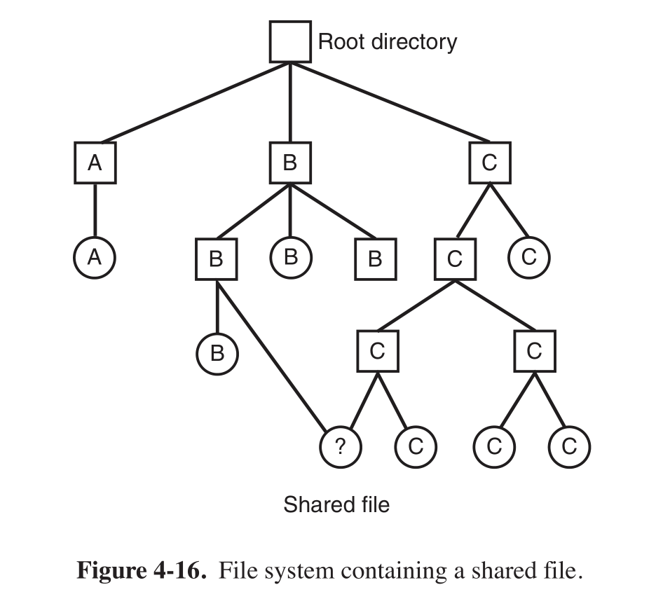

* 进程运行时，可以在自己的地址空间存储信息，但这样保存信息的问题是
  * 对于一些程序，如银行系统，这样的存储空间太小
  * 进程终止时，保存的信息就丢失了
  * 经常需要多个进程访问同一信息，这要求信息独立于任何一个进程
* 因此，长期存储信息有三个基本要求
  * 能够存储大量信息
  * 使用信息的进程终止时，信息仍存在
  * 允许多个进程并发访问信息
* 理论上，磁盘（magnetic disk）就能解决长期存储的问题，但实际上，有许多操作不便于实现
  * 如何找到信息
  * 如何防止一个用户读取另一个用户的数据
  * 如何知道哪些块是空闲的
* 为了解决这个问题，引入文件的概念，它是一个建模于磁盘的抽象概念
* 文件由操作系统管理，文件的构造、命名、访问、使用、保护、实现、管理方法是操作系统设计的主要内容，操作系统中处理文件的部分称为文件系统（file system）

## 文件

### 文件命名

* 各个系统中的文件命名规则不同，现代操作系统都允许用 1 到 8 个字母组成的字符串作为合法的文件名，通常也允许有数字和一些特殊字符
* 一般操作系统支持文件名用圆点分隔为两部分，如 `main.cpp`，圆点后的部分称为文件扩展名（file extension）。UNIX 中，文件扩展名只是一种约定，Windows 中的扩展名则有特别意义，用户或进程可以在操作系统中注册扩展名，并规定哪个程序拥有该扩展名（即双击该文件则启动此程序并运行该文件）

### 文件结构

* 文件可以有多种构造方式
  * 常见的一种构造方式是无结构的单字节序列，操作系统见到的就是字节，文件内容的任何含义只在用户程序中解释，UNIX 和 Windows 都采用这种方法。这为操作系统提供了最大的灵活性，用户可以向文件中加入任何内容，以任何形式命名，操作系统不提供帮助也不进行阻碍
  * 第二种构造方式是固定长度记录的序列，这种方式的中心思想是，读操作返回一个记录，写操作重写或追加一个记录。几十年前，80 列的穿孔卡片是主流时，很多大型机的操作系统使用的就是这种方式，文件由 80 个字符的记录组成，文件系统建立在这种文件基础上
  * 第三种构造方式是用一棵记录树构成文件，记录的固定位置有一个键，树按键排序，从而可以对键进行快速查找，这种方式被广泛用于处理商业数据的大型计算机

### 文件类型

* 操作系统一般支持多种文件类型，UNIX 和 Windows 都有普通文件（regular file）和目录（directory），此外 UNIX 还有字符特殊文件（character special file）和块特殊文件（block special file）
* 普通文件一般分为 ASCII 文件和二进制文件
  * ASCII 文件由多行正文组成，每行用回车符或换行符或两者（如 MS-DOS）结束，其最大优势是可以显示、打印、编辑，如果很多程序都用 ASCII 文件作为输入和输出，就很容易把一个程序的输出作为另一个程序的输入
  * 二进制文件打印出来是充满乱码的表，通常二进制文件有一定的内部结构，使用该文件的程序才了解这种结构。比如 UNIX 存档文件，每个文件以模块头开始，其中记录了名称、创建日期、所有者、保护码、文件大小，该模块头与可执行文件一样都是二进制数字，打印输出它们毫无意义

### 文件访问

* 早期操作系统只有顺序访问（sequential access）一种文件访问方式，进程可以从头按顺序读取文件的字节，不能跳过某一些内容。在存储介质是磁带而不是磁盘时，顺序访问文件是很方便的
* 用磁盘存储文件时，就能以任何次序读取文件的字节，能被这种方式访问的文件称为随机访问文件（random access file）。对许多程序来说，随机访问文件必不可少，比如数据库系统，查找一条记录时，不需要先读出之前的成千上万条记录

### 文件属性

* 除了文件名和数据，操作系统还会保存文件相关的信息，如创建日期、文件大小等，这些附加信息称为文件属性（attribute）或元数据（metadata）。不同系统中的文件属性差别很大

### 文件操作

* 使用文件是为了存储信息并方便以后检索，不同的操作系统提供了不同的方式，常见的文件相关的系统调用有 `create`、`delete`、`open`、`close`、`read`、`write`、`append`、`seek`、`get attributes`、`set attributes`、`rename`

## 目录

* 目录系统的最简单形式是单层目录系统，即一个目录中包含所有文件，这个目录通常称为根目录，其优势是简单，且能快速定位文件，常用于简单的嵌入式装置，如电话、数码相机
* 现在的用户通常有成千上万的文件，用单层目录寻找文件就很困难了，这就需要层次结构（即一个目录树），几乎所有现代文件系统使用的都是层次目录系统。用目录树组织文件系统时，常用绝对路径名（absolute path name）或相对路径名（relative path name）来指明文件名
* UNIX 中常见的目录操作的系统调用有 `create`、`delete`（只能删除空目录）、`opendir`、`closedir`、`readdir`、`rename`、`link`（类似创建快捷方式）、`unlink`

## 文件系统的实现

### 文件系统布局

* 文件系统存放在磁盘上。多数磁盘划分为一个或多个分区，每个分区中有一个独立的文件系统
* 磁盘的 0 号扇区称为主引导记录（Master Boot Record，MBR），用来引导计算机
* MBR 的结尾是分区表，该表给出了每个分区的起始地址和结束地址。表中的一个分区被标记为活动分区，计算机被引导时，BIOS 读入并执行 MBR，MBR 做的第一件事就是确定活动分区，读入第一个块，即引导块（boot block），并执行
* 除了引导块，磁盘分区的布局通常随文件系统的不同而变化，一个可能的文件系统布局如下

```
|-----------------整个磁盘-----------------|
  分区表               磁盘分区
     ↓       ↙     ↙        ↘        ↘
 __________________________________________
|MBR||||________|________|________|________|
               /          \
              /            \

|引导块|超级块|空闲空间管理|i节点|根目录|文件和目录|
```

### 文件的实现

* 文件存储实现的关键是记录文件用到了哪些磁盘块，不同的操作系统的实现方式不同
* 最简单的方式是连续分配，每个文件作为一连串连续数据块存储在磁盘上，比如块大小为 1 KB 的磁盘上，50 KB 的文件要分配 50 个连续的块。每个文件都要从一个新的块开始，上一个文件末尾块可能会存在部分被浪费的空间
* 连续分配的优势是实现简单，只需要为每个文件记录第一块的磁盘地址和使用的块数，另外读操作性能较好，单个操作就可以读出整个文件
* 缺点是删除文件会在磁盘中留下断断续续的空闲块。压缩磁盘代价太高，不可行。维护一个空闲块链表，但创建新文件时，为了选择选择合适的空闲区，必须先给出文件的最终大小，如果用户要创建一个文档然后录入，用户是无法给出最终大小的。但这在 CD-ROM 中是可行的，因为所有文件的大小都事先定好了，并且后续使用也不会被改变
* 第二种方式是链式分配，这样不会因为磁盘碎片而浪费存储空间，但随机访问很慢，每次要访问一个块时，都必须从第一个块开始。此外，指向下一个块的指针占用了一些字节，每个磁盘块存储数据的字节数不再是 2 的整数次幂，虽然这个问题不是非常严重，但也会降低系统的运行效率，因为程序一般以长度为 2 的整数次幂来读写磁盘块
* 第三种方式是把链式分配的指针放到内存的一个表中，这个表称为文件分配表（File Allocation Table，FAT），这样就解决了大小不正常带来的问题，但如果表项过多，比如 1 TB 的磁盘和 1 KB 的块，FAT 有 10 亿项，每项至少占 3 字节，这就占了 3 GB 内存，因此 FAT 在大型磁盘中不实用
* 最后一种方式是为每个文件赋予一个 i 节点（index-node）的数据结构，其中列出了文件属性和文件块的磁盘地址。给定 i 节点就能找到文件的所有块，这种方式相对于 FAT 的优势是，只有在文件打开时，其 i 节点才在内存中，最终需要的内存与同时打开的最大文件数成正比

### 目录的实现

* 读文件时必须先打开文件，打开文件时，操作系统利用路径名找到目录项，目录项中提供了查找文件磁盘块所需要的信息。这些信息与系统有关，信息可能是整个文件的磁盘地址（对于连续分配的系统）、第一块的编号（链式分配）、i 节点号。文件属性存放的位置可以是目录项或者 i 节点
* 现代操作系统一般都支持长度可变的长文件名。最简单的实现方式是，给文件名一个长度限制，如 255 个字符，并为每个文件名保留该长度的空间，这种方式简单但浪费了大量目录空间
* 第二种方式是，每个目录项中开头有一个记录目录项长度的固定部分，接着是文件属性、任意长度的文件名。缺点和连续分配的磁盘碎片问题一样，移除一个个文件后会留下断断续续的空隙。由于整个目录在内存中，只有对目录进行紧凑操作才能节省空间。另一个问题是一个目录项可能会分布在多个页面上，读取文件名时可能发生缺页中断
* 第三种方式是，使目录项有固定长度，将文件名放在目录后面的堆上，并管理这个堆，这样移除一个目录项后，下一个进来的目录项总可以填满这个空隙
* 线性查找文件名要从头到尾搜索目录，对于非常长的目录，一个优化方式是在每个目录中使用散列表来映射文件名和对应的目录项

### 共享文件

* 几个用户在同一个项目中工作时常需要共享文件。对于如下文件系统，B 与 C 有一个共享文件，B 的目录与该文件的联系称为一个链接（link）。这样，文件系统本身是一个有向无环图（Derected Acyclic Graph，DAG）而不是一棵树，代价是维护变得复杂



* 共享文件的问题是，如果目录中包含磁盘地址，链接文件时必须将 C 目录中的磁盘地址复制到 B 目录中，如果 B（或 C）往文件中添加内容，新数据块只会列入 B（或 C）的用户目录中，C（或 B）对此改变是不知道的，这就违背了共享的目的
* 解决这个问题的第一个方法是，磁盘块不列入目录，而是列入一个与文件关联的小型数据结构，目录将指向这个小型数据结构。这是 UNIX 的做法，小型数据结构就是 i 节点
* 这种方法的缺点是，B 链接该共享文件时，i 节点记录的文件所有者仍是 C，只是将 i 节点的链接计数加 1，以让系统知道该文件有多少个指向它的目录项。如果 C 之后删除了这个文件，B 就有一个指向无效的i节点的目录项。如果这个 i 节点之后分配给另一个文件，B 的链接将指向一个错误的文件。系统可以通过i节点的计数知道文件被引用，但无法找到所有目录项并删除，也不可能把目录项指针存储在 i 节点中，因为可能有无数个这样的目录
* 第二个方法是符号链接（symbolic linking），让系统建立一个 LINK 类型的文件，把该文件放在 B 目录下，使得 B 与 C 的一个文件存在链接。LINK 文件中包含了要链接的文件的路径名，B 读该链接文件时，操作系统发现是 LINK 类型，则找到其链接文件的路径并读取
* 符号链接在文件被删除后，通过路径名查找文件将失败，因此不会有第一种方法的问题。符号链接的问题在于需要额外开销，必须读取包含路径的文件，然后逐步扫描路径直到找到 i 节点，这些操作可能需要很多次额外的磁盘访问
* 此外，所有方式的链接都存在的一个问题是，文件有多个路径，如果查找文件，将多次定位到被链接的文件，如果一个程序的功能是查找某个文件并复制，就可能导致多次复制同一文件

### 日志结构文件系统（Log-structured File System，LFS）

* 设计 LFS 的主要原因是，CPU 运行速度越来越快，RAM 内存变得更大，磁盘高速缓存迅速增加，不需要磁盘访问操作，就可能满足直接来自高速缓存的大部分读请求，由此可以推断，未来的磁盘访问多数是写操作，且写操作往往是零碎的，提前读机制并不能获得更好的性能
* 因此 LFS 的设计者决定重新实现一种 UNIX 文件系统，即使面对一个由大部分为零碎的随机写操作组成的任务，也能够充分利用磁盘带宽
* 基本思路是，将整个磁盘结构化为一个日志，最初所有写操作都缓冲在内存中，每隔一段时间或有特殊需要时，被缓冲在内存中未执行的写操作被放到一个单独的段中，作为日志末尾的一个邻接段被写入磁盘
* 但磁盘空间不是无限大的，这种做法最终将导致日志占满整个磁盘，此时就无法再写入新的段。为了解决这个问题，LFS 有一个清理线程，该线程周期性扫描日志进行磁盘压缩。整个磁盘成为一个大的环形缓冲区，写线程将新的段写到前面，清理线程将旧的段从后面移走
* LFS 在处理大量零碎写操作时的性能比 UNIX 好一个数量级，在处理读和大块写操作时的性能也不比 UNIX 差，甚至更好

### 日志文件系统

* 由于 LFS 和现有的文件系统不相匹配，所以还未被广泛使用，但其内在的一个思想，即面对出错的鲁棒性，可以被其他文件系统借鉴。这个基本想法是，保存一个用于记录系统下一步要做什么的日志。当系统在完成任务前崩溃时，重新启动后，就能通过查看日志获取崩溃前计划完成的任务。这样的文件系统被称为日志文件系统，并已被实际使用，比如微软的 NTFS、Linux ext3、RerserFS，OS X将日志文件系统作为可选项提供

### 虚拟文件系统（Virtual File System，VFS）

* 同一台计算机或同一个操作系统中，可以有多个不同的文件系统
* Windows 有一个主要的 NTFS 文件系统，但也有一个包含 FAT-32 或 FAT-16 的驱动器或分区，此外还可能有 CD-ROM 或者 DVD（每一个包含特定文件系统），Windows 通过指定盘符来处理不同的文件系统，进程打开文件时，盘符是显式或隐式存在的，Windows 由此可知向哪个文件系统传递请求，不需要将不同的文件系统整合为统一模式
* 所有现代的 UNIX 尝试将多种文件系统整合到一个统一的结构中。一个 Linux 系统可以用 ext2 作为根文件系统，ext3 分区装载在 `/usr` 下，采用 RerserFS 的文件系统的硬盘装载在 `/home` 下，ISO 9660 的 CD-ROM 临时装载在 `/mnt` 下。用户视角中，只有一个文件系统层级，但实际上是对用户和进程不可见的多种不相容的文件系统
* 但是多种文件系统的存在在实际应用中是明确可见的，以前大多 UNIX 操作系统都使用 VFS 概念尝试将多种文件系统统一成一个有序结构，其核心思想是抽象出所有文件系统共有的部分为单独一层，这一层通过调用底层的实际文件系统来具体管理数据
* UNIX 中，所有文件相关的系统调用最初都指向 VFS，这些来自用户进程的调用都是标准的 POSIX 系统调用，VFS 对用户进程提供的上层接口就是 POSIX 接口。VFS 也有一个对于实际文件系统的下层接口，即 VFS 接口，当创造一个新的文件系统和 VFS 一起工作时，新系统的设计者必须确定它提供 VFS 所需要的功能调用

```
--------------------------------
用户进程
--------------------------------
|
|             POSIX 接口
↓
--------------------------------
VFS
--------------------------------
|    |    |
|    |    |   VFS 接口
↓    ↓    ↓
--------------------------------
FS1  FS2  FS3 实际文件系统
--------------------------------
↑    ↑    ↑
|    |    |
↓    ↓    ↓
--------------------------------
高速缓冲区
--------------------------------
```

## 文件系统管理和优化

### 磁盘空间管理

* 几乎所有文件系统都将文件分割成固定大小的块存储，各块之间不一定相邻。块的大小是一个需要考虑的问题，块太小则文件块数越多，需要更多次的寻道与旋转延迟才能读出它们，从而降低了性能。块太大，则文件的最后一个块存在空间浪费。从历史观点上来说，一般设将块大小为 1 到 4 KB，但随着现在磁盘超过了 1 TB，磁盘空间已经不再短缺了，将块的大小提升到 64 KB并接受一些浪费比较好
* 选定块大小后，下一个问题是如何记录空闲块。有两种方法被广泛使用，一是链表，二是位图
* 为了防止占用太多磁盘空间，多用户操作系统通常提供了强制性磁盘配额机制，系统管理员为每个用户分配拥有文件和块的最大数量，操作系统确保每个用户不超过得到的配额

### 文件系统备份

* 磁盘转储到磁带上有两种方案
  * 物理转储：从磁盘的第 0 块开始，将全部的磁盘块按序输出到磁带上，直到最后一块复制完毕
  * 逻辑转储：从一个或几个指定的目录开始，递归地转储其自给定日期后有所更改的全部文件和目录

### 文件系统的一致性

* 很多文件系统读取磁盘块，修改后再写回磁盘。如果在写回完成前系统崩溃，文件系统可能处于不一致状态。为此，很多计算机都有一个检查文件系统一致性的实用程序，比如 UNIX 的 fsck、Windows 的 scandisk，系统启动时，特别是崩溃后的重启，可以运行该程序
* 一致性检查分两种
  * 块的一致性检查：程序构造两张表，每张表为每个块设立一个计数器，第一张表记录块在文件中的出现次数，第二张记录块在空闲区的出现次数。如果文件系统一致，最终每一个块在其中一张表中的计数器为1，如果一个块在两张表中的计数器都为0，则称为块丢失
  * 文件的一致性检查：原理同上，区别是一个文件（而非一个块）对应一个计数器。注意，由于存在硬链接，一个文件可能出现在多个目录中。而遇到符号链接是不计数的，不会对目标文件的计数器加1

### 文件系统性能

* 访问磁盘比访问内存慢很多，如果只需要一个字，内存访问可以比磁盘访问快百万数量级，因此许多文件系统采用了各种优化措施来改善性能
* 最常用的减少磁盘访问次数的技术是块高速缓存（block cache）或缓冲区高速缓存（buffer cache），它们逻辑上属于磁盘，但实际上保存在内存中
* 第二个明显提高性能的技术是块提前读，在需要用到块之前先将块提前写入高速缓存，从而提高命中率。块提前读只适用于顺序读取的文件，如果请求文件系统在某个文件中生成一个块，文件系统将潜在地检查高速缓存，如果下一个块不在缓存中，则为下一个块安排一个预读
* 另一个重要技术是把可能顺序访问的块放在一起，最好是在同一个柱面上，从而减少磁盘臂的移动次数。这个技术仅当磁盘中装有磁盘臂时才有意义，现在固态硬盘（SSD）越来越流行，而它们不带移动部件。固态硬盘采用了和闪存同样的制造技术，使得随机访问与顺序访问在传输速度上已经较为接近，传统硬盘的诸多问题就消失了，但也有一些新问题，比如每一块只可写入有限次数，使用时要十分小心以达到均匀分散磨损的目的

### 磁盘碎片整理

* 随着不断创建与删除文件，磁盘会逐渐产生许多碎片，创建一个新文件时，其使用的块会散布在整个磁盘上，造成性能降低
* 一个恢复方式是，移动文件使其相邻，把空闲区放到一个或多个大的连续区域内。Windows 有一个 defrag 程序，就是用于完成这项工作的，Windows 用户应该定期使用它。Linux 文件系统由于其选择磁盘块的方式，在磁盘碎片整理上一般不会遇到 Windows 那样的困难，因此很少需要手动整理磁盘碎片
* 固态硬盘不受磁盘碎片的影响，对其做磁盘碎片整理不仅没有提高性能，反而磨损了硬盘，缩短了使用寿命
